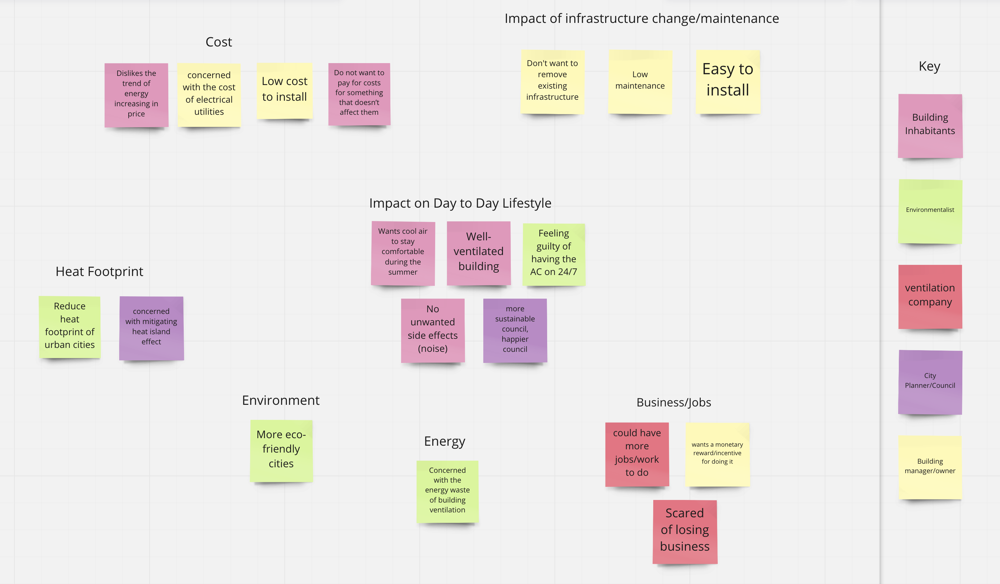
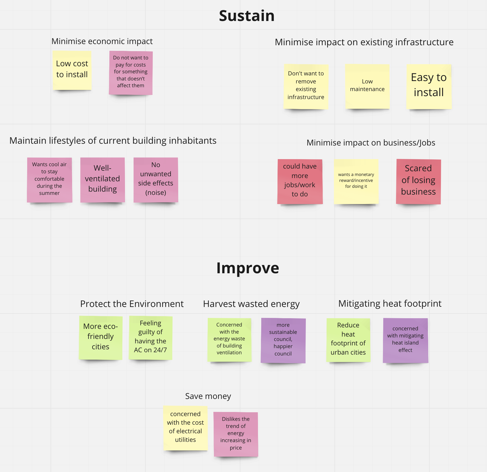
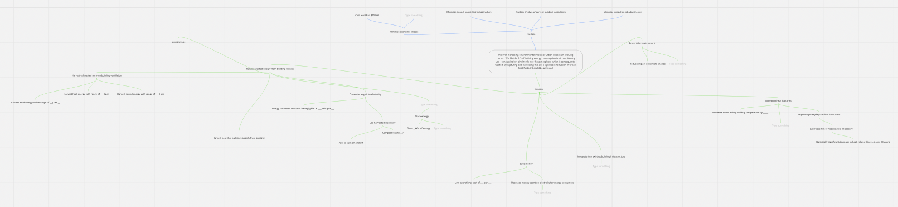

# Define 📚

Translation of user-focused thinking to technical-focused thinking.

> CN: Customer needs

> FR: Functional requirements

## Work Packages 💼

[TOC]

## Affinity Map CN to FR 🗺

Translating CN to FR lets us shift our user-focused thinking into technical-focused thinking.

Customer needs **are** requirements. However, customer needs may not cleanly translate to the solution which is why functional requirements need to be developed. The tool we use to deduce what our functional requirements are is affinity mapping (which is a method of categorisation).

From our list of customer needs (from this [Google Doc](https://docs.google.com/document/d/1A06ONjj7tLm_xGvUQfQnWL-As_b0yvIB1bE-RqM8eos/edit), we categorised the customer needs into general requirements. This is the first draft:



We further refined the affinity map into the following as we fleshed out the categories into root functional requirements:



There was a clean trend where `sustain` was closely related to constraints and `improve` was closely to functional requirements.

## FR Hierarchy 🌳

Decomposition of the highest-level FR into lower-level FRs.

The root functional requirements that we have identified were:
- Protect the environment.
- Harvest wasted energy.
- Mitigating heat footprint.
- Save money.

The root constraints that we have identified were:
- Minimise economic impact.
- Minimise impact on existing infrastructure.
- Maintain lifestyles of current building inhabitants.
- Minimise impact on business/jobs.

The next step is to decompose the above requirements (green are functional requirements, blue are constraints):



## Problem Area Research 🧐

### Gathering Field Data 🏑

First-hand data helps to inform what the FR metrics should be.

We gathered first-hand data by finding AC ventilation and measuring the temperature and airflow.

<table>
    <tr>
        <th>Date</th>
        <td>2022/09/06, 1800</td>
    </tr>
    <tr>
        <th>Weather</th>
        <td>19 °C, 0 m/s winds</td>
    </tr>
    <tr>
        <th>Location</th>
        <td>6/180 Thomas St, Haymarket</td>
    </tr>
</table>


<table>
<thead>
  <tr>
    <th>Location</th>
    <th>Temperature (°C)</th>
    <th>Airflow (m/s)</th>
    <th>Average Temperature (°C)</th>
    <th>Average Airflow (m/s)</th>
  </tr>
</thead>
<tbody>
  <tr>
    <td rowspan="3">L1<br>(Control)</td>
    <td>19.4</td>
    <td>0.00</td>
    <td rowspan="3">19.4</td>
    <td rowspan="3">0.00</td>
  </tr>
  <tr>
    <td>19.4</td>
    <td>0.00</td>
  </tr>
  <tr>
    <td>19.4</td>
    <td>0.00</td>
  </tr>
  <tr>
    <td rowspan="6">L2</td>
    <td>21.1</td>
    <td>1.58</td>
    <td rowspan="6">21.47</td>
    <td rowspan="6">1.43</td>
  </tr>
  <tr>
    <td>21.0</td>
    <td>1.35</td>
  </tr>
  <tr>
    <td>21.8</td>
    <td>1.20</td>
  </tr>
  <tr>
    <td>21.8</td>
    <td>1.21</td>
  </tr>
  <tr>
    <td>21.6</td>
    <td>1.57</td>
  </tr>
  <tr>
    <td>21.5</td>
    <td>1.64</td>
  </tr>
  <tr>
    <td rowspan="7">L3</td>
    <td>21.5</td>
    <td>1.54</td>
    <td rowspan="7">21.4</td>
    <td rowspan="7">1.69</td>
  </tr>
  <tr>
    <td>21.5</td>
    <td>1.75</td>
  </tr>
  <tr>
    <td>21.1</td>
    <td>1.57</td>
  </tr>
  <tr>
    <td>21.1</td>
    <td>1.30</td>
  </tr>
  <tr>
    <td>21.5</td>
    <td>1.82</td>
  </tr>
  <tr>
    <td>21.4</td>
    <td>1.67</td>
  </tr>
  <tr>
    <td>21.7</td>
    <td>2.18</td>
  </tr>
  <tr>
    <td rowspan="7">L4</td>
    <td>21.8</td>
    <td>1.21</td>
    <td rowspan="7">21.27</td>
    <td rowspan="7">1.24</td>
  </tr>
  <tr>
    <td>21.3</td>
    <td>1.23</td>
  </tr>
  <tr>
    <td>21.7</td>
    <td>1.30</td>
  </tr>
  <tr>
    <td>21.3</td>
    <td>1.35</td>
  </tr>
  <tr>
    <td>21.3</td>
    <td>0.98</td>
  </tr>
  <tr>
    <td>21.1</td>
    <td>1.33</td>
  </tr>
  <tr>
    <td>20.4</td>
    <td>1.31</td>
  </tr>
</tbody>
</table>

The [recommended internal building temperature](https://www.designingbuildings.co.uk/wiki/Temperature_in_buildings) is 21 °C for thermal comfort. It is clear to see that the exhausted air temperature is close.

<table>
<thead>
  <tr>
    <th>Location</th>
    <th>Temperature Difference Between Control and Building (°C)</th>
    <th>Airflow Difference Between Control and Building (m/s)</th>
  </tr>
</thead>
<tbody>
  <tr>
    <td>L2</td>
    <td>2.07</td>
    <td>1.43</td>
  </tr>
  <tr>
    <td>L3</td>
    <td>2.00</td>
    <td>1.69</td>
  </tr>
  <tr>
    <td>L4</td>
    <td>1.87</td>
    <td>1.24</td>
  </tr>
  <tr>
    <td>Average</td>
    <td>1.98</td>
    <td>1.45</td>
  </tr>
</tbody>
</table>

Summarised image (green is control data, red is independent data, blue is building):


### HVAC Systems Research 💨

### Ventilation Flow Rate 🎏

```math
```

Where:
- $``$ is the .

### Turbelence 🏸

[Turbelence is a fluid motion characterised by chaotic changes in pressure and flow velocity](https://en.wikipedia.org/wiki/Turbulence).

Turbelence is characterised by:
- Irregularity.
- Diffusivity.
- Rotationality.
- Dissipation:

Turbelence can be predicted by the Reynolds number (the larger the number, the more likely turbelence will occur):

```math
\text{Re} = \frac{\rho v L}{\mu}
```

Where:
- $`\rho`$ is the fluid density $`(kg/m^3)`$.
- $`v`$ is the fluid velocity $`(m/s)`$.
- $`L`$ is the linear dimension $`(m)`$.
- $`\mu`$ is the fluid dynamic viscosity $`(Ns/m^2)`$.

## Defining FR Metrics 💯

The definition of metrics helps specify the FR.

## Defining Design Constraints 🛑

