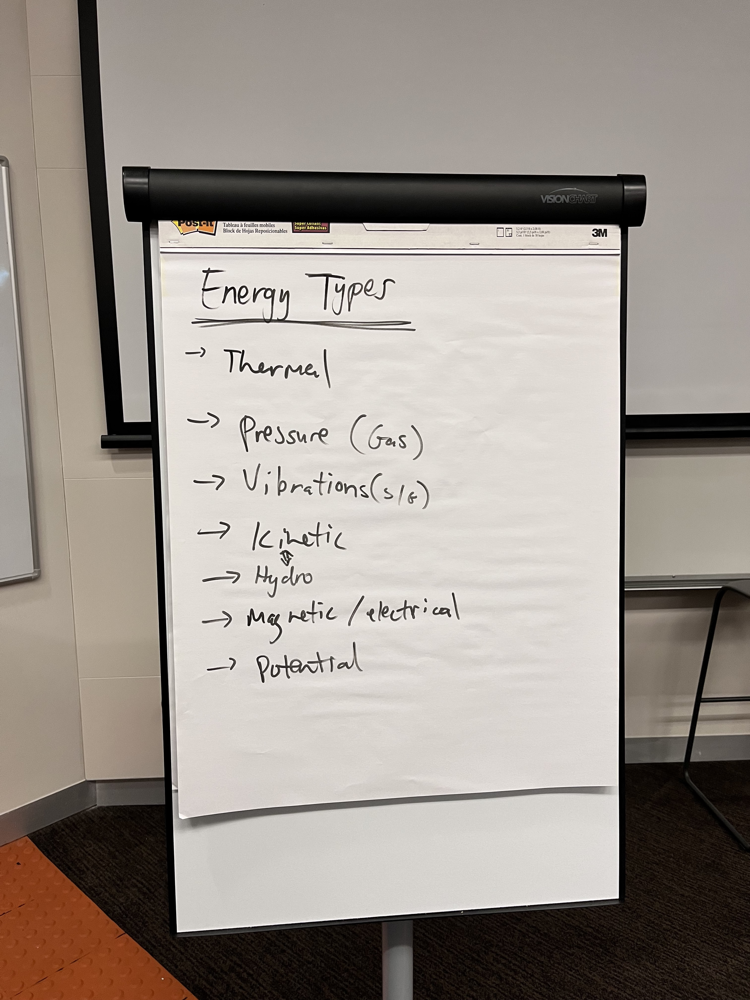
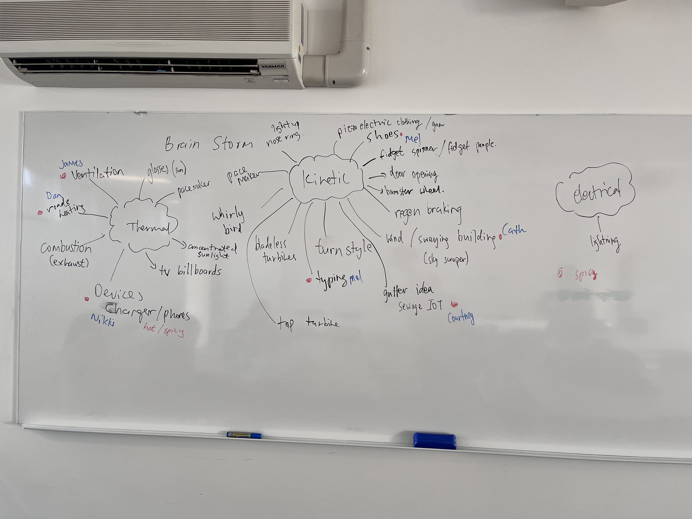
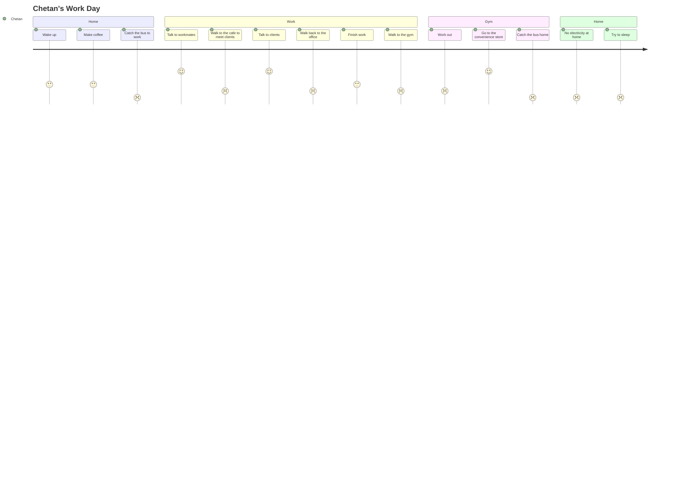

# Empathise 🥺

User-focused thinking of problem spaces and refinement of a problem statement.

## Work Packages 💼

[TOC]

## Brainstorming Problem Areas 🧠

Brainstorm problem areas related to energy, energy harvesting, and energy loss in order to develop a problem statement.

<details><summary>Risks</summary>

- Easy to think too low-level early which will derail the process.
- Large search space can result in too much time used for brainstorming.

</details>

### Energy Types

Brainstormed energy types to set the parameters of the project brief.



### Energy Sources

Brainstormed general sources of energy.


This then expanded to include specific sources of energy focused around energy loss.



## Researching Problem Areas 🧩

Further research into problem areas to:
- Identify the stakeholders within these problem spaces.
- The marketability of the problem.
- Presence of data and previous research.
- The innovativeness of the problem i.e. presence of existing solutions and their innovativeness.

<table>
<thead>
  <tr>
    <th>Problem Statement</th>
    <th>Potential Stakeholders</th>
    <th>Marketability/Profitability (who would we be marketing this to)</th>
    <th>Presence of Data, Previous Research</th>
    <th>Existing Solutions?</th>
    <th>Potential Concepts/Solutions by us.How does it address the 4 design concepts (materials, fasteners, sensors, power transmissions)?What’s the triple constraint theory looking like?<br>Btw this step is actually cheating a bit but idc (we won’t include this in any final reports)</th>
  </tr>
</thead>
<tbody>
  <tr>
    <td>Roads around the world use asphalt as its primary material. Many roads are exposed to the sun which makes them radiators of heat with blacktop temperatures consistently higher than the surrounding environment. How can the heat lost from roads be utilised?</td>
    <td>City planners<br>Drivers (daily commuter, freights)<br>Energy consumers (business, homes, street lights)<br>Road constructors<br>Pedestrians<br>Cyclists<br>Environmentally-conscious persons</td>
    <td>Market towards city planners, civil engineers, and city residents as an innovative strategy to combat urban heat island effect.<br>Market towards road constructors as a generation of new trades which can be integrated with existing companies.<br>Market towards city planners and energy-grid maintainers that this is a passive source of income.<br>Market towards city planners as a way to increase the lifetime of roads:<br>Reduce temperature fluctuation to reduce degree of expansion and compression.<br>Lower activation temperature of bitumen to avoid “flushed” or “bleeding” roads.<br>Safer for drivers.<br>Market towards energy consumers and environmentally-conscious persons as a new source of green energy.<br>Market towards pedestrians and cyclists about reducing the heat island effect to create a human-friendly(?) environment.</td>
    <td>Temperature of pavements vs air: <a href="https://www.sciencedirect.com/science/article/pii/S2214509516300043">https://www.sciencedirect.com/science/article/pii/S2214509516300043</a>. Roads are HOT.<br>Comparison of thermal performance of different pavement materials: <a href="https://www-sciencedirect-com.wwwproxy1.library.unsw.edu.au/science/article/pii/B9781782423805000042">https://www-sciencedirect-com.wwwproxy1.library.unsw.edu.au/science/article/pii/B9781782423805000042</a>. <br><br>Modelling road surface temperatures: <a href="https://rmets-onlinelibrary-wiley-com.wwwproxy1.library.unsw.edu.au/doi/full/10.1002/met.1305">https://rmets-onlinelibrary-wiley-com.wwwproxy1.library.unsw.edu.au/doi/full/10.1002/met.1305</a>. Paper uses statistics, but we can use a 1D diffusion equation. Factors of road temperatures are:<br>Air temperature<br>Radiation fluxes<br>Humidity<br>Precipitation<br>Wind<br>Topography<br>Properties of road material<br>Traffic<br>Heat exchanger to de-ice roads in winter:<br><a href="https://www-sciencedirect-com.wwwproxy1.library.unsw.edu.au/science/article/pii/S1359431116315393">https://www-sciencedirect-com.wwwproxy1.library.unsw.edu.au/science/article/pii/S1359431116315393</a>. Decreased max temperature values during summer between 3.8 and 7.5 degrees Celsius.<br><br>Determination of maximum pavement temperature: <a href="https://austroads.com.au/publications/pavement/agpt04k/determination-of-maximum-pavemensslknndn">https://austroads.com.au/publications/pavement/agpt04k/determination-of-maximum-pavemensslknndn</a>. This is the regulation of required environmental temperatures before laying down pavement.<br>Contributes to the heat island effect: <a href="https://www.epa.gov/green-infrastructure/reduce-urban-heat-island-effect">https://www.epa.gov/green-infrastructure/reduce-urban-heat-island-effect</a>. Heat island effect occurs in areas of dense pavement, buildings, and concrete surfaces that absorb and retain heat. This causes increased energy cost (for cooling), air pollution, and heat-related illnesses. Current strategies to reduce heat island effect are building green infrastructure i.e. integrating vegetation.</td>
    <td>Green infrastructure.<br>Water retaining pavements which reduces heat island effect as well as urban flooding.<br>Kinki Uni: <a href="https://www.sciencedirect.com/science/article/abs/pii/S095965261832239X">https://www.sciencedirect.com/science/article/abs/pii/S095965261832239X</a><br>Melb water: <a href="https://www.melbournewater.com.au/building-and-works/stormwater-management/options-treating-stormwater/porous-paving">https://www.melbournewater.com.au/building-and-works/stormwater-management/options-treating-stormwater/porous-paving</a><br>Heat exchanger to de-ice roads in winter: <a href="https://www-sciencedirect-com.wwwproxy1.library.unsw.edu.au/science/article/pii/S1359431116315393">https://www-sciencedirect-com.wwwproxy1.library.unsw.edu.au/science/article/pii/S1359431116315393</a>. Stick aluminium into ground as piles (no structural function) to create pathways for spontaneous transfer of geothermal energy to street surface. Piles are connected to thin layer of high thermal conductivity material placed directly under pavement as hollow blocks or large mesh (can adapt to deformations). </td>
    <td>Heat exchanging mesh bed under road:<br>Roads are lifted then reworked all the time so the effort to implement this is not high.<br>Mesh bed addresses road deformation and porous materials.<br>Definitely tackles materials and power transmission.<br>This problem statement can expand to train tracks.</td>
  </tr>
  <tr>
    <td>Skyscrapers are susceptible to really high wind speeds and can sway and vibrate as a result, requiring design features like holes and twisted sides. How can we utilise the wind incident on skyscrapers, and reduce the effect of wind on skyscrapers and pedestrians at ground level?</td>
    <td>People living/working in the buildings (could be affected by noise or aesthetics of our design)<br>Architects<br>Developers<br>Street pedestrians <br></td>
    <td>We would likely be marketing this to developers. Not a pressing issue, but could be attractive as the wind energy could be repurposed as electrical energy for the building <br>Market this to developers to hit renewable energy targets and make use of city's sustainability incentives eg. in the US there's a certification program that encourages sustainability</td>
    <td>Completed in 2010, the Strata SE1, a/k/a the Razor, is a 43-story residential skyscraper in London that has three turbines on the roof, making the building look like an electric razor. The turbines were expected to generate 8% of the building’s total energy consumption.<br>The Bahrain World Trade Center is a twin-towered projected, which opened in 2008. In between the two fifty-story buildings are three turbines rotating around three horizontal beams connected to each tower. The turbines were designed to add a relatively modest cost of 3% and were expected to generate 11% to 15% of the towers’ energy consumption. The buildings were also shaped to funnel the wind directly to the turbines.<br>The Pearl River Tower is a 71-story skyscraper in Guangzhou, China. Completed in 2011, it has vertical turbines placed at about one-third and two-thirds the way up inside the belly of the structure. They are placed on mechanical floors, which have no windows and are exposed directly to the wind. Initial studies predicted that the façade openings would accelerate the wind speed by 2.5 times, resulting in more than eight times the power generation when compared to a turbine located in an open field.</td>
    <td>Wind turbine integration in skyscraper design:<br><a href="https://fttechnologies.com/case-studies/skyscrapers-integrated-wind-turbines/">https://fttechnologies.com/case-studies/skyscrapers-integrated-wind-turbines/</a><br>Energy regenerative tuned mass dampers in high rise buildings:<br><a href="https://onlinelibrary.wiley.com/doi/10.1002/stc.2072">https://onlinelibrary.wiley.com/doi/10.1002/stc.2072</a><br>Energy harvesting from high rise buildings by piezoelectric harvester device:<br><a href="https://inis.iaea.org/search/search.aspx?orig_q=RN:48003805">https://inis.iaea.org/search/search.aspx?orig_q=RN:48003805</a><br>Turbine shaped building that spin slowly<br><a href="https://interestingengineering.com/culture/turbine-shaped-skyscraper-concept-rotates-with-the-wind">https://interestingengineering.com/culture/turbine-shaped-skyscraper-concept-rotates-with-the-wind</a></td>
    <td>Harvesting accelerated wind caused by the downdraught effect to reduce wind at street level. Small vertical turbines like this:<br><a href="https://www.goodnewsnetwork.org/onshore-wind-turbines-powered-by-traffic/">https://www.goodnewsnetwork.org/onshore-wind-turbines-powered-by-traffic/</a>(honestly this highway wind idea is really good, could also harvest wind in metro and train tunnels)<br></td>
  </tr>
  <tr>
    <td>The usage of portable electronics devices such as phones, GPS devices and laptops. Power demand is usually met by batteries which have to be recharged or replaced, limiting operating time and generating waste. For users such as those living in developing countries or travelling in remote areas where the power grid may not be well developed or stable, it is not always viable to simply connect and recharge. How can we harvest energy from human motion to power portable devices?</td>
    <td>Backpackers/hikers <br>People in developing countries<br>Environmentally conscious people<br>Users of technology, especially students/workers<br>Engineers/developers that work at cool technology places<br>Energy companies because we don’t’ need their juice as much</td>
    <td>Devices utilising this technology would be marketed towards anybody that uses portable electronic devices, especially those in areas/situations where power is unreliable/unavailable. <br>The technology itself would be marketed towards developers who are able to implement and commercialise it. <br>Profitable as it would connect people all over the world and help those who don’t have access to electricity. </td>
    <td>How much do people walk a day in developing countries:<br><a href="https://www.usaid.gov/global-waters/may-2011/six-kilometers-day#:~:text=On%20average%2C%20women%20and%20girls,than%2015%20hours%20a%20week">https://www.usaid.gov/global-waters/may-2011/six-kilometers-day#:~:text=On%20average%2C%20women%20and%20girls,than%2015%20hours%20a%20week</a>. <br>Sugarcane wastage as a piezoelectric material: <br><a href="https://ipb.ac.id/news/index/2018/07/ipb-students-utilize-sugar-cane-as-piezoelectric-electricity-generator/72a093bb7fb77991afb8e7897b3dd2da">https://ipb.ac.id/news/index/2018/07/ipb-students-utilize-sugar-cane-as-piezoelectric-electricity-generator/72a093bb7fb77991afb8e7897b3dd2da</a> <br>How much power: (apparently not enough, would need to write one full novel to provide enough energy for a laptop to run for 15 seconds. Need to find a more efficient way to convert energy)<br><a href="https://what-if.xkcd.com/102/">https://what-if.xkcd.com/102/</a> </td>
    <td><a href="https://www.sciencedirect.com/science/article/abs/pii/S2211285521004882">https://www.sciencedirect.com/science/article/abs/pii/S2211285521004882</a><br>KTMH is able to scavenge mechanical energy from keystrokes, delivering a maximum power of 7.04mW from electromagnetic and 1.8mW from the triboelectric unit from a single key. For an average typing speed o f 4 characters per second, the keyboard scavenges 5.6mW and 1.4mW respectively. </td>
    <td>Keyboard with piezoelectric materials so when someone types, kinetic energy is converted into electric energy and can be used to help power the laptop. </td>
  </tr>
  <tr>
    <td>Prosthetic devices are usually powered by batteries which require charging, for the Power Knee it is as often as every 6 hours. This is a major inconvenience and safety hazard because if the battery fails/runs out, the device cannot be used. Electronic prostheses are also often heavy and cannot be used around water due to potential damage to the battery. How can we use human motion to power a safer prosthetic device?</td>
    <td>Amputees/people that wear prosthetic devices<br>Family members/carers of ^<br>Healthcare workers<br>Engineers/developers that work at cool technology places<br>Energy companies because we don’t’ need their juice as much</td>
    <td>Devices utilizing this technology would be marketed towards carers/medical workers who can recommend these devices to amputees/people who require prosthetics. <br>The technology would be marketed towards developers who are able to implement and commercialize it. <br>Profitable as it would be safer and more reliable than existing prosthetic devices. </td>
    <td>How much do prosthetic users walk: <br><a href="https://pure.strath.ac.uk/ws/portalfiles/portal/44535874/Buis_etal_JPO_2014_Measuring_the_daily_stepping_activity_of_people_with_transtibial_amputation.pdf">https://pure.strath.ac.uk/ws/portalfiles/portal/44535874/Buis_etal_JPO_2014_Measuring_the_daily_stepping_activity_of_people_with_transtibial_amputation.pdf</a> <br>A 80kg person walking at 4km/h can generate approximately 2W from their heel strike movement.  <a href="https://jneuroengrehab.biomedcentral.com/articles/10.1186/1743-0003-8-22">https://jneuroengrehab.biomedcentral.com/articles/10.1186/1743-0003-8-22</a></td>
    <td><a href="https://jneuroengrehab.biomedcentral.com/articles/10.1186/1743-0003-8-22">https://jneuroengrehab.biomedcentral.com/articles/10.1186/1743-0003-8-22</a><br>Using a viscoelastic material in the midsole, for a runner moving at 4.5m/s the energy dissipated in a single step ranges from 1.72- 10.32J and most of it is lost during the heel strike. <br>A shoe with this technology: <br><a href="https://spie.org/news/3749-a-scalable-solution-to-harvest-kinetic-energy?SSO=1">https://spie.org/news/3749-a-scalable-solution-to-harvest-kinetic-energy?SSO=1</a><br>Kidding i found an existing one but they use hydraulics so ours is still sort of different?<br><a href="https://patents.google.com/patent/US20180036148A1/en?q=energy+harvesting+prosthetic&oq=energy+harvesting+prosthetic">https://patents.google.com/patent/US20180036148A1/en?q=energy+harvesting+prosthetic&amp;oq=energy+harvesting+prosthetic</a> </td>
    <td>Shoes/prosthetic legs with kinetic energy collectors in the sole utilising the heel strike to transform kinetic energy to electric, storing and using to power the prosthetic device or be stored in the shoe to be used as a portable charger. </td>
  </tr>
  <tr>
    <td>Train stations/highways/airports can be very loud noise sources for commuters and nearby communities. How can we utilise this sound energy to help reduce noise pollution and/or improve  transport hubs?</td>
    <td>Commuters, drivers<br>People who live near train stations/highways<br>People who work there<br>Transport company/council </td>
    <td>Market towards government/councils for improved safety, better health and lifestyle for the community <br><br></td>
    <td>A lot of data present on negative health effects of noise pollution such as railway noise and airport noise on communities that live nearby<br></td>
    <td>Couple of different ways energy from trains can be harvested, including rotatory electromagnetic, acoustic energy harvester, piezoelectric and linear electromagnetic:<br><a href="https://www.sciencedirect.com/science/article/pii/S2352484721000883">https://www.sciencedirect.com/science/article/pii/S2352484721000883</a></td>
    <td>Harvest the sound and vibration energy and use it to power noise cancelling speakers that emit waves that cancel out the original noise pollution (safety - don't want to cancel out station announcements). Noise cancelling is a bit difficult in a large room/open area compared to noise cancelling, but is possible <a href="https://www.theguardian.com/science/2020/jul/09/noise-control-sound-wave-system-cancels-out-drum-of-traffic">https://www.theguardian.com/science/2020/jul/09/noise-control-sound-wave-system-cancels-out-drum-of-traffic</a><br>Harvest the sound and vibration energy and use it to power glass platform screen doors/lights for improved safety on platforms<br> </td>
  </tr>
  <tr>
    <td>Wastewater pipes are monitored by small IOTs placed by human workers in strategic locations. These IOTs run on batteries, and must be replaced by humans.<br>How can we use the flow of wastewater to power the IOTs, removing the need for battery maintenance?</td>
    <td>Sydney water - cheaper maintenance<br>Sydney water employees - reduced need to go into sewage (better health)</td>
    <td>No need to replace batteries, healthier working conditions, more environmentally friendly than batteries</td>
    <td>Data about turbines in wastewater:<br><a href="https://www.researchgate.net/publication/328089089_Utilization_of_Hydro-Turbines_in_Wastewater_Treatment_Plants_WWTPs">https://www.researchgate.net/publication/328089089_Utilization_of_Hydro-Turbines_in_Wastewater_Treatment_Plants_WWTPs</a> <br>Data about wastewater:<br>Wastewater tunnel width:<br><a href="https://www.tunneltalk.com/MacDow-Mar95-Blue-Mountains-record-breaker.php">https://www.tunneltalk.com/MacDow-Mar95-Blue-Mountains-record-breaker.php</a><br>Data about turbines:<br>Zero head turbine: <a href="http://www.ijmse.org/Volume2/Issue7/paper7.pdf">http://www.ijmse.org/Volume2/Issue7/paper7.pdf</a> <br>Micro turbines:<br><a href="https://www.energy.gov/energysaver/planning-microhydropower-system">https://www.energy.gov/energysaver/planning-microhydropower-system</a><br></td>
    <td>Battery powered IOTs (some say battery life is 2 years, some 7-8 years, some less than 1 year)</td>
    <td>Small turbine placed in the wastewater flow, which turns the generator, which powers IoT devices.<br><br>Maths about power:<br>[net head (feet) × flow (gpm)] ÷ 10 = W (Power or Watts)<br>0.2 feet * ~100,000 gpm / 10 = 2000 W<br>Maths about feasibility: •Required flow rate for turbine:<br>•The minimum flow requirements are 20 cfs at 40 psi.<br>•232,630 gpm<br>•Flow rate of sewage systems:<br>•the flow velocity in high-grit sewage handling systems should not exceed 12 ft/sec. the flow velocity in sewage systems with low grit concentrations should not exceed 18 ft/sec.<br>•102,341 gpm<br>Probably not viable to have a turbine powered by the flow of sewage.<br>EDIT: with a weir, this could be possible.<a href="https://www.researchgate.net/figure/a-Top-view-of-micro-weir-microchannel-and-b-side-view-of-micro-weir-microchannel_fig11_255688817">https://www.researchgate.net/figure/a-Top-view-of-micro-weir-microchannel-and-b-side-view-of-micro-weir-microchannel_fig11_255688817</a> </td>
  </tr>
  <tr>
    <td>Construction sites are sources of constant loud noise. How can this noise be utilised to make energy?</td>
    <td>Construction site workers<br>Residents<br>Energy consumers</td>
    <td>Market to city planners and residents as a strategy to reduce noise pollution in urban centres.</td>
    <td>Power generation using sound by piezoelectric material: <a href="https://iopscience.iop.org/article/10.1088/1742-6596/1916/1/012003/pdf#:~:text=when%20sound%20energy%20is%20applied,electric%20energy%20from%20sound%20energy">https://iopscience.iop.org/article/10.1088/1742-6596/1916/1/012003/pdf#:~:text=when%20sound%20energy%20is%20applied,electric%20energy%20from%20sound%20energy</a>.<br>City of Sydney, Code of practice, construction hours and noise in city centre: <a href="https://www.cityofsydney.nsw.gov.au/development-guidelines-policies/code-practice-construction-hours-noise-city">https://www.cityofsydney.nsw.gov.au/development-guidelines-policies/code-practice-construction-hours-noise-city</a>. Allowable noise levels:<br><br>Prolonged 60 dB or immediately above 120 dB is damaging to ears: <a href="https://www.cdc.gov/nceh/hearing_loss/what_noises_cause_hearing_loss.html">https://www.cdc.gov/nceh/hearing_loss/what_noises_cause_hearing_loss.html</a></td>
    <td>Someone trialled piezoelectric transducers in Alexandria but on small scale: <a href="https://journals.plos.org/plosone/article?id=10.1371/journal.pone.0219373">https://journals.plos.org/plosone/article?id=10.1371/journal.pone.0219373</a>. 690 transducers in 1.45 m^2 area produced 0.024 Whr.<br></td>
    <td>Convert sound energy to electrical energy with piezoelectric mats. Convert stored electrical energy into cancelling whitenoise to further reduce construction site noise.</td>
  </tr>
  <tr>
    <td>Phone chargers convert AC power from the outlet  to DC power for phones which generates heat in the process. <br>How can the heat loss from chargers be converted into useful energy?</td>
    <td>People who own phone chargers<br>Companies who manufacture phones (could be something they add in to improve the efficiency of their phone chargers)</td>
    <td>This could be marketed to the general consumer if it is a product that can be attached onto any phone charger. Then, anybody could purchase the product and use it to make their phone charger more efficient.<br>If the existing design of phone chargers has to be modified, then this could be marketed towards phone companies so they can implement it into their existing chargers. </td>
    <td>No significant research done on energy harvesting from phone chargers, however, there is a lot of research on thermoelectric energy harvesting (harvesting wasted thermal energy and converting it into electricity)<br>Research on how body heat can be harvested using TEGs to charge mobile devices: <a href="https://www.researchgate.net/publication/313584376_Thermoelectric_energy_harvesting_for_mobile_phone_charging_application">https://www.researchgate.net/publication/313584376_Thermoelectric_energy_harvesting_for_mobile_phone_charging_application</a><br>Need a significant temperature difference, a heat sink can be used as a cooling method <br>Energy conversion was not very efficient - up to 2 per cent<br>Paper on how a TEG can be used to harvest energy from a cooking stove and then used to power a gas leakage detection IoT device: <a href="https://www.researchgate.net/publication/331823373_Development_of_Smart_Cooking_Stove_Harvesting_Energy_from_the_Heat_Gas_Leakage_Detection_and_IoT_Based_Notification_System">https://www.researchgate.net/publication/331823373_Development_of_Smart_Cooking_Stove_Harvesting_Energy_from_the_Heat_Gas_Leakage_Detection_and_IoT_Based_Notification_System</a></td>
    <td>No existing solutions specifically for phone chargers, however, there are many existing thermoelectric generators which have been used for other applications (e.g. harvest body heat to charge phones). </td>
    <td>Addresses fasteners and power transmission<br>Use a TEG with a heatsink and harvest the temperature difference between the charger and the ambient air to get an output voltage. Voltage then most likely needs to be stepped up to meet phone voltage demands (approx. 5V). </td>
  </tr>
  <tr>
    <td>Buildings often exhaust a lot of thermal energy from ventilation and cooling needs.<br>How can the heat from ventilation exhaust be converted into useful energy?</td>
    <td>Residents<br>Developers<br>Maintainers of buildings<br>Construction companies<br>Environmentalists<br>City Planners</td>
    <td>People who run and maintain the buildings could reduce electrical costs when they use the energy that is harvested.<br>Property developers could see this as a way of making their buildings more sustainable.<br>Customers of buildings (small and large) could see to having the system retrofitted or installed during construction.<br>High impact as there are buildings everywhere that they all have ventilation due to building codes.<br>Some / good level of profitability if the system is cheap enough and produces good energy.<br>Electrical companies.<br>Also, heat island effect.</td>
    <td>This is something that has definitely been studied in depth.<br>Some parts of the house / building definitely produce a lot of heat.<br>General ventilation knowledge:<br><a href="https://www.ncbi.nlm.nih.gov/books/NBK143277/">https://www.ncbi.nlm.nih.gov/books/NBK143277/</a><br>Heat exchanger system:<br><a href="https://www.wikiwand.com/en/Heat_recovery_ventilation">https://www.wikiwand.com/en/Heat_recovery_ventilation</a><br>Another heat recovery system.<br><a href="https://passivehouse.com.au/page/ventilation---heat-energy-recovery">https://passivehouse.com.au/page/ventilation---heat-energy-recovery</a><br>Facts about HVAC:<br><a href="https://www.energy.gov.au/business/equipment-and-technology-guides/hvac">https://www.energy.gov.au/business/equipment-and-technology-guides/hvac</a></td>
    <td>Lots of research as governments do activally push initiatives.<br>Though current systems exchanges heat for heat, and not necessarily heat to electricity.<br>Research on waste heat recovery in apartment buildings:<br><a href="https://www.sciencedirect.com/science/article/pii/S2666202721000641">https://www.sciencedirect.com/science/article/pii/S2666202721000641</a><br>Oscillating heat pipes?<br><a href="https://www.sciencedirect.com/science/article/pii/S2352484716300427">https://www.sciencedirect.com/science/article/pii/S2352484716300427</a><br><a href="https://link.springer.com/article/10.1007/s11630-019-1178-5">https://link.springer.com/article/10.1007/s11630-019-1178-5</a><br>Heat recovery:<br><a href="https://www.diva-portal.org/smash/record.jsf?pid=diva2%3A1346703&dswid=-9770">https://www.diva-portal.org/smash/record.jsf?pid=diva2%3A1346703&amp;dswid=-9770</a><br><a href="https://www.sciencedirect.com/science/article/pii/S235271022100111X">https://www.sciencedirect.com/science/article/pii/S235271022100111X</a><br>Potential recovery solutions:<br><a href="https://www.energy.gov.au/business/equipment-and-technology-guides/waste-heat-recovery">https://www.energy.gov.au/business/equipment-and-technology-guides/waste-heat-recovery</a><br></td>
    <td>We would have to come up with a different mechanism to extract waste heat from the system.<br>Throw in a Stirling engine?<br>Currently the heat is used to spin turbines, and is touted to be less efficient than just directly exchanging heat. Maybe we just need to make it more efficient.</td>
  </tr>
</tbody>
</table>

> This work was done within a [Google Doc](https://docs.google.com/document/d/1lhBVNqQttMCyS-LZkeU3rhdo17ehIDjxk5FEoXpYh4c/edit?usp=sharing).

## Evaluating Problem Areas 🤔

Evaluate problem areas to narrow down the problem areas. The deliverable for this work package is a single problem space that the team wants to solve.

<details><summary>Risks</summary>

- Not knowing how to fill out the charts.

</details>

This was a three step process:
1. Identify the selection criteria to measure the problem areas against.
1. Conducting a pair-wise comparison (PCC) chart to weigh the selection criteria in terms of importance to us.
1. Filling a best-of-class (BOC) chart to score the problem areas with the selection criteria weighting.

> This work was done within a [Google Sheet](https://docs.google.com/spreadsheets/d/15Y5BLjWYeOzdiXMWd3SZe7I68tTQgj5_khv4GgHinzo/edit?usp=sharing).

### Selection Criteria

The identified selection criteria for problem areas are:
- Stakeholder Impact.
- Number of Stakeholders.
- Complementary Impacts.
- Innovativeness.
- Compatibility with Report Requirements.
- Realistic/Feasible.

### PCC

Dan's PCC:

|                                        | Stakeholder Impact | Number of Stakeholders | Complementary Impacts | Innovativeness | Compatibility with Report Requirements | Realistic/Feasible |
|----------------------------------------|--------------------|------------------------|-----------------------|----------------|----------------------------------------|--------------------|
| Stakeholder Impact                     |          -         |            1           |           1           |        0       |                    0                   |          0         |
| Number of Stakeholders                 |          0         |            -           |           0           |        0       |                    0                   |          0         |
| Complementary Impacts                  |          0         |            1           |           -           |        0       |                    1                   |          1         |
| Innovativeness                         |          1         |            1           |           1           |        -       |                    1                   |          1         |
| Compatibility with Report Requirements |          1         |            1           |           0           |        0       |                    -                   |          1         |
| Realistic/Feasible                     |          1         |            1           |           0           |        0       |                    0                   |          -         |

Court's PCC:

|                                        | Stakeholder Impact | Number of Stakeholders | Complementary Impacts | Innovativeness | Compatibility with Report Requirements | Realistic/Feasible |
|----------------------------------------|--------------------|------------------------|-----------------------|----------------|----------------------------------------|--------------------|
| Stakeholder Impact                     |          -         |            1           |           1           |        0       |                    0                   |          0         |
| Number of Stakeholders                 |          0         |            -           |           1           |        0       |                    0                   |          1         |
| Complementary Impacts                  |          0         |            0           |           -           |        0       |                    0                   |          0         |
| Innovativeness                         |          1         |            1           |           1           |        -       |                    0                   |          1         |
| Compatibility with Report Requirements |          1         |            1           |           1           |        1       |                    -                   |          1         |
| Realistic/Feasible                     |          1         |            0           |           1           |        0       |                    0                   |          -         |

Melissa's PCC:

|                                        | Stakeholder Impact | Number of Stakeholders | Complementary Impacts | Innovativeness | Compatibility with Report Requirements | Realistic/Feasible |
|----------------------------------------|--------------------|------------------------|-----------------------|----------------|----------------------------------------|--------------------|
| Stakeholder Impact                     |          -         |            1           |           1           |        0       |                    0                   |          0         |
| Number of Stakeholders                 |          0         |            -           |           1           |        0       |                    0                   |          1         |
| Complementary Impacts                  |          0         |            0           |           -           |        0       |                    0                   |          0         |
| Innovativeness                         |          1         |            1           |           1           |        -       |                    0                   |          1         |
| Compatibility with Report Requirements |          1         |            1           |           1           |        1       |                    -                   |          1         |
| Realistic/Feasible                     |          1         |            0           |           1           |        0       |                    0                   |          -         |

Nikki's PCC:

|                                        | Stakeholder Impact | Number of Stakeholders | Complementary Impacts | Innovativeness | Compatibility with Report Requirements | Realistic/Feasible |
|----------------------------------------|--------------------|------------------------|-----------------------|----------------|----------------------------------------|--------------------|
| Stakeholder Impact                     |          -         |            1           |           1           |        1       |                    0                   |          0         |
| Number of Stakeholders                 |          0         |            -           |           1           |        0       |                    0                   |          0         |
| Complementary Impacts                  |          0         |            0           |           -           |        0       |                    0                   |          0         |
| Innovativeness                         |          0         |            1           |           1           |        -       |                    0                   |          1         |
| Compatibility with Report Requirements |          1         |            1           |           1           |        1       |                    -                   |          1         |
| Realistic/Feasible                     |          1         |            1           |           1           |        0       |                    0                   |          -         |

Catherine's PCC:

|                                        | Stakeholder Impact | Number of Stakeholders | Complementary Impacts | Innovativeness | Compatibility with Report Requirements | Realistic/Feasible |
|----------------------------------------|--------------------|------------------------|-----------------------|----------------|----------------------------------------|--------------------|
| Stakeholder Impact                     |          -         |            1           |           1           |        1       |                    0                   |          0         |
| Number of Stakeholders                 |          0         |            -           |           0           |        0       |                    0                   |          0         |
| Complementary Impacts                  |          0         |            1           |           -           |        1       |                    0                   |          0         |
| Innovativeness                         |          0         |            1           |           0           |        -       |                    0                   |          0         |
| Compatibility with Report Requirements |          1         |            1           |           1           |        1       |                    -                   |          1         |
| Realistic/Feasible                     |          1         |            1           |           1           |        1       |                    0                   |          -         |

James' PCC:

|                                        | Stakeholder Impact | Number of Stakeholders | Complementary Impacts | Innovativeness | Compatibility with Report Requirements | Realistic/Feasible |
|----------------------------------------|--------------------|------------------------|-----------------------|----------------|----------------------------------------|--------------------|
| Stakeholder Impact                     |          -         |            1           |           1           |        0       |                    0                   |          1         |
| Number of Stakeholders                 |          0         |            -           |           1           |        0       |                    0                   |          1         |
| Complementary Impacts                  |          0         |            0           |           -           |        1       |                    0                   |          1         |
| Innovativeness                         |          1         |            1           |           0           |        -       |                    0                   |          1         |
| Compatibility with Report Requirements |          1         |            1           |           1           |        1       |                    -                   |          1         |
| Realistic/Feasible                     |          0         |            0           |           0           |        0       |                    0                   |          -         |

Final PCC:

| Criteria                               | Court | Dan | Melissa | Nikki | Catherine | James |      |
|----------------------------------------|-------|-----|---------|-------|-----------|-------|------|
| Stakeholder Impact                     | 4.4   | 2   | 2       | 3     | 3         | 3     | 2.90 |
| Number of Stakeholders                 | 4.4   | 0   | 2       | 1     | 0         | 2     | 1.57 |
| Complementary Impacts                  | 0     | 3   | 0       | 0     | 2         | 2     | 1.17 |
| Innovativeness                         | 7.6   | 5   | 4       | 3     | 1         | 3     | 3.93 |
| Compatibility with Report Requirements | 9.8   | 3   | 5       | 5     | 5         | 5     | 5.47 |
| Realistic/Feasible                     | 3.2   | 2   | 2       | 3     | 4         | 0     | 2.37 |

### BOC

BOC was scored between 0-4 with 4 being best.

Dan's BOC:

|                                                                                                                                                                    | Stakeholder Impact | Number of Stakeholders | Complementary Impacts | Innovativeness | Compatibility with Report Requirements | Realistic/Feasible |
|--------------------------------------------------------------------------------------------------------------------------------------------------------------------|--------------------|------------------------|-----------------------|----------------|----------------------------------------|--------------------|
|                                                                                                                                                                    |        2.90        |          1.57          |          1.17         |      3.93      |                  5.47                  |        2.37        |
| How can the heat lost from roads be utilised?                                                                                                                      |                  4 |                      4 |                     4 |              3 |                                      3 |                  1 |
| How can we utilise the wind incident on skyscrapers, and reduce the effect of wind on skyscrapers and pedestrians at ground level (streetlevel vertical turbines)? |                  3 |                      4 |                     3 |              2 |                                      3 |                  3 |
| How can we harvest energy from human motion to power portable devices?                                                                                             |                  3 |                      2 |                     2 |              4 |                                      4 |                  4 |
| How can we use human motion to power a safer prosthetic device?                                                                                                    |                  4 |                      1 |                     3 |              3 |                                      4 |                  4 |
| How can we utilise this sound energy to help reduce noise pollution and/or improve  transport hubs/construction sites?                                             |                  4 |                      3 |                     3 |              4 |                                      4 |                  3 |
| How can we use the flow of wastewater to power the IOTs, removing the need for battery maintenance?                                                                |                  3 |                      1 |                     2 |              4 |                                      3 |                  2 |
| How can the heat loss from chargers be converted into useful energy?                                                                                               |                  2 |                      2 |                     1 |              3 |                                      3 |                  1 |
| How can the heat from ventilation exhaust be converted into useful energy?                                                                                         |                  4 |                      4 |                     3 |              4 |                                      3 |                  2 |

Court's BOC:

|                                                                                                                                                                    | Stakeholder Impact | Number of Stakeholders | Complementary Impacts | Innovativeness | Compatibility with Report Requirements | Realistic/Feasible |
|--------------------------------------------------------------------------------------------------------------------------------------------------------------------|--------------------|------------------------|-----------------------|----------------|----------------------------------------|--------------------|
|                                                                                                                                                                    |        2.90        |          1.57          |          1.17         |      3.93      |                  5.47                  |        2.37        |
| How can the heat lost from roads be utilised?                                                                                                                      |                  1 |                      3 |                     3 |              4 |                                      3 |                  3 |
| How can we utilise the wind incident on skyscrapers, and reduce the effect of wind on skyscrapers and pedestrians at ground level (streetlevel vertical turbines)? |                  1 |                      2 |                     3 |              3 |                                      2 |                  1 |
| How can we harvest energy from human motion to power portable devices?                                                                                             |                  0 |                      3 |                     0 |              1 |                                      3 |                  1 |
| How can we use human motion to power a safer prosthetic device?                                                                                                    |                  4 |                      1 |                     4 |              1 |                                      3 |                  1 |
| How can we utilise this sound energy to help reduce noise pollution and/or improve  transport hubs/construction sites?                                             |                  4 |                      2 |                     4 |              3 |                                      2 |                  0 |
| How can we use the flow of wastewater to power the IOTs, removing the need for battery maintenance?                                                                |                  0 |                      0 |                     2 |              4 |                                      0 |                  1 |
| How can the heat loss from chargers be converted into useful energy?                                                                                               |                  1 |                      3 |                     0 |              0 |                                      1 |                  3 |
| How can the heat from ventilation exhaust be converted into useful energy?                                                                                         |                  2 |                      2 |                     4 |              4 |                                      4 |                  2 |

Melissa's BOC:

|                                                                                                                                                                    | Stakeholder Impact | Number of Stakeholders | Complementary Impacts | Innovativeness | Compatibility with Report Requirements | Realistic/Feasible |
|--------------------------------------------------------------------------------------------------------------------------------------------------------------------|--------------------|------------------------|-----------------------|----------------|----------------------------------------|--------------------|
|                                                                                                                                                                    |        2.90        |          1.57          |          1.17         |      3.93      |                  5.47                  |        2.37        |
| How can the heat lost from roads be utilised?                                                                                                                      |                  1 |                      2 |                     2 |              3 |                                      3 |                  2 |
| How can we utilise the wind incident on skyscrapers, and reduce the effect of wind on skyscrapers and pedestrians at ground level (streetlevel vertical turbines)? |                  3 |                      2 |                     2 |              2 |                                      2 |                  1 |
| How can we harvest energy from human motion to power portable devices?                                                                                             |                  1 |                      1 |                     2 |              1 |                                      2 |                  1 |
| How can we use human motion to power a safer prosthetic device?                                                                                                    |                  3 |                      2 |                     4 |              3 |                                      2 |                  3 |
| How can we utilise this sound energy to help reduce noise pollution and/or improve  transport hubs/construction sites?                                             |                  2 |                      3 |                     3 |              3 |                                      3 |                  2 |
| How can we use the flow of wastewater to power the IOTs, removing the need for battery maintenance?                                                                |                  1 |                      1 |                     2 |              3 |                                      3 |                  2 |
| How can the heat loss from chargers be converted into useful energy?                                                                                               |                  1 |                      1 |                     2 |              2 |                                      3 |                  2 |
| How can the heat from ventilation exhaust be converted into useful energy?                                                                                         |                  2 |                      3 |                     3 |              3 |                                      3 |                  2 |

Nikki's BOC:

|                                                                                                                                                                    | Stakeholder Impact | Number of Stakeholders | Complementary Impacts | Innovativeness | Compatibility with Report Requirements | Realistic/Feasible |
|--------------------------------------------------------------------------------------------------------------------------------------------------------------------|--------------------|------------------------|-----------------------|----------------|----------------------------------------|--------------------|
|                                                                                                                                                                    |        2.90        |          1.57          |          1.17         |      3.93      |                  5.47                  |        2.37        |
| How can the heat lost from roads be utilised?                                                                                                                      |                  2 |                      2 |                     1 |              1 |                                      4 |                  2 |
| How can we utilise the wind incident on skyscrapers, and reduce the effect of wind on skyscrapers and pedestrians at ground level (streetlevel vertical turbines)? |                  2 |                      1 |                     1 |              1 |                                      3 |                  2 |
| How can we harvest energy from human motion to power portable devices?                                                                                             |                  1 |                      1 |                     1 |              2 |                                      3 |                  2 |
| How can we use human motion to power a safer prosthetic device?                                                                                                    |                  2 |                      0 |                     2 |              3 |                                      2 |                  2 |
| How can we utilise this sound energy to help reduce noise pollution and/or improve  transport hubs/construction sites?                                             |                  2 |                      3 |                     2 |              2 |                                      4 |                  3 |
| How can we use the flow of wastewater to power the IOTs, removing the need for battery maintenance?                                                                |                  0 |                      0 |                     1 |              3 |                                      2 |                  1 |
| How can the heat loss from chargers be converted into useful energy?                                                                                               |                  1 |                      2 |                     1 |              2 |                                      3 |                  2 |
| How can the heat from ventilation exhaust be converted into useful energy?                                                                                         |                  2 |                      2 |                     2 |              3 |                                      4 |                  3 |

Catherine's BOC:

|                                                                                                                                                                    | Stakeholder Impact | Number of Stakeholders | Complementary Impacts | Innovativeness | Compatibility with Report Requirements | Realistic/Feasible |
|--------------------------------------------------------------------------------------------------------------------------------------------------------------------|--------------------|------------------------|-----------------------|----------------|----------------------------------------|--------------------|
|                                                                                                                                                                    |        2.90        |          1.57          |          1.17         |      3.93      |                  5.47                  |        2.37        |
| How can the heat lost from roads be utilised?                                                                                                                      |                  3 |                      4 |                     2 |              3 |                                      3 |                  1 |
| How can we utilise the wind incident on skyscrapers, and reduce the effect of wind on skyscrapers and pedestrians at ground level (streetlevel vertical turbines)? |                  2 |                      3 |                     2 |              2 |                                      3 |                  4 |
| How can we harvest energy from human motion to power portable devices?                                                                                             |                  1 |                      2 |                     0 |              2 |                                      2 |                  2 |
| How can we use human motion to power a safer prosthetic device?                                                                                                    |                  2 |                      1 |                     0 |              2 |                                      3 |                  2 |
| How can we utilise this sound energy to help reduce noise pollution and/or improve  transport hubs/construction sites?                                             |                  4 |                      3 |                     2 |              4 |                                      3 |                  2 |
| How can we use the flow of wastewater to power the IOTs, removing the need for battery maintenance?                                                                |                  1 |                      0 |                     0 |              4 |                                      3 |                  1 |
| How can the heat loss from chargers be converted into useful energy?                                                                                               |                  1 |                      2 |                     1 |              3 |                                      3 |                  2 |
| How can the heat from ventilation exhaust be converted into useful energy?                                                                                         |                  2 |                      3 |                     2 |              3 |                                      3 |                  3 |

James' BOC:

|                                                                                                                                                                    | Stakeholder Impact | Number of Stakeholders | Complementary Impacts | Innovativeness | Compatibility with Report Requirements | Realistic/Feasible |
|--------------------------------------------------------------------------------------------------------------------------------------------------------------------|--------------------|------------------------|-----------------------|----------------|----------------------------------------|--------------------|
|                                                                                                                                                                    |        2.90        |          1.57          |          1.17         |      3.93      |                  5.47                  |        2.37        |
| How can the heat lost from roads be utilised?                                                                                                                      |                  2 |                      3 |                     2 |              2 |                                      2 |                  1 |
| How can we utilise the wind incident on skyscrapers, and reduce the effect of wind on skyscrapers and pedestrians at ground level (streetlevel vertical turbines)? |                  3 |                      3 |                     2 |              2 |                                      4 |                  3 |
| How can we harvest energy from human motion to power portable devices?                                                                                             |                  1 |                      2 |                     1 |              2 |                                      2 |                  2 |
| How can we use human motion to power a safer prosthetic device?                                                                                                    |                  4 |                      3 |                     2 |              4 |                                      4 |                  2 |
| How can we utilise this sound energy to help reduce noise pollution and/or improve  transport hubs/construction sites?                                             |                  1 |                      2 |                     2 |              3 |                                      2 |                  2 |
| How can we use the flow of wastewater to power the IOTs, removing the need for battery maintenance?                                                                |                  1 |                      2 |                     2 |              3 |                                      2 |                  1 |
| How can the heat loss from chargers be converted into useful energy?                                                                                               |                  1 |                      1 |                     0 |              2 |                                      1 |                  1 |
| How can the heat from ventilation exhaust be converted into useful energy?                                                                                         |                  2 |                      2 |                     2 |              3 |                                      4 |                  3 |

Final BOC:

| Concepts                                                                                                                                                           | Court | Dan   | Melissa | Nikki | Catherine | James |       |
|--------------------------------------------------------------------------------------------------------------------------------------------------------------------|-------|-------|---------|-------|-----------|-------|-------|
| How can the heat lost from roads be utilised?                                                                                                                      | 50.33 | 53.10 | 41.30   | 40.63 | 47.87     | 34.00 | 44.54 |
| How can we utilise the wind incident on skyscrapers, and reduce the effect of wind on skyscrapers and pedestrians at ground level (streetlevel vertical turbines)? | 34.63 | 49.83 | 35.33   | 33.60 | 46.57     | 52.57 | 42.09 |
| How can we harvest energy from human motion to power portable devices?                                                                                             | 27.40 | 61.23 | 24.03   | 34.63 | 29.57     | 30.73 | 34.60 |
| How can we use human motion to power a safer prosthetic device?                                                                                                    | 40.53 | 59.80 | 46.33   | 35.60 | 36.37     | 60.97 | 46.60 |
| How can we utilise this sound energy to help reduce noise pollution and/or improve  transport hubs/construction sites?                                             | 42.13 | 64.50 | 46.93   | 49.67 | 55.50     | 35.83 | 49.09 |
| How can we use the flow of wastewater to power the IOTs, removing the need for battery maintenance?                                                                | 20.43 | 49.47 | 39.73   | 26.27 | 37.40     | 33.47 | 34.46 |
| How can the heat loss from chargers be converted into useful energy?                                                                                               | 20.17 | 40.67 | 35.80   | 36.20 | 40.13     | 20.17 | 32.19 |
| How can the heat from ventilation exhaust be converted into useful energy?                                                                                         | 55.93 | 58.23 | 46.93   | 52.03 | 48.13     | 52.03 | 52.22 |

## Problem Statement ⁉️

A problem statement sets the objective for the team.

<details><summary>Risks</summary>

- Team not on the same page as the problem statement.

</details>

From the selection of a problem space from the evaluation step, a problem statement was then defined:

> The ever-increasing environmental impact of urban cities is an evolving concern. Worldwide, 1/5 of building energy consumption is air conditioning use - exhausting hot air directly into the atmosphere which is consequently wasted. By capturing and harvesting the energy of the exhausted air, we can reuse the energy to power devices which directly benefit the residents.

## Identifying Stakeholders 👥

Identifying stakeholders is an important first step of user-centred design. It sets the parameters of who to consider when solving the problem.

The identified stakeholders were:
- Building inhabitants.
- Energy consumers.
- Building manager, building owner.
- Environmentalists.
- City planners, council.
- Architects.
- Ventilation companies.

## Creating Personas 👤

After identification of the stakeholders, we expand on who these stakeholders are to make them more relatable to us as people and to the problem.

We also need to ask our personas:
- What do they want?
- Why do they want it?

User requirements elaborate on what our personas want. The user requirements we use are in the form of user stories:
```
As a [user], I want to [need], so I can [context]
```

> This work was done within a [Google Doc](https://docs.google.com/document/d/1QcTmauxbnZnFPAq2-T5k6lEO8NxcR10Ln2A-Wx-NyZU/edit?usp=sharing).

### Chetan

24


Financial Consultant / Apartment Resident

<table>
<tr>
    <th>Activities</th>
    <td>Works in the CBD as a financial consultant to small and medium-sized businesses.<br><br>

Goes to the gym and takes boxing classes after work in an effort to maintain a healthy lifestyle.

Recently bought a Nintendo Switch and plays Animal Crossing until it is time to sleep.
    </td>
</tr>
<tr>
    <th>Environments</th>
    <td>Chetan lives in a hot tropical climate with wet and dry seasons. The region’s average yearly temperature is 27.3° C.<br><br>

The provincial capital (which is where Chetan currently lives) is a rapidly developing city. However, the city (especially the poorer neighbourhoods) is prone to electrical outages due to an inefficient, outdated, and overworked electricity grid.


His hometown had higher rates of poverty and lacked AC units due to their high price. Chetan’s family uses standing fans as they are extremely cheap.


Chetan’s workplace is a shared office outfitted with a single outdated AC which struggles to effectively cool the entire space. This is most noticeable when all employees are in the office, and the office is only a couple degrees cooler than outside.

Chetan’s gym is not outfitted with an AC unit. The gym gets very hot especially when there are multiple patrons.

Chetan having recently starting his consulting career is renting a cheap unit and is saving up to buy his own apartment in the provincial capital.
    </td>
</tr>
<tr>
    <th>Life Events</th>
    <td>Completed university at the country’s capital.<br><br>

Had moved to the provincial capital city from a rural town after receiving an offer to start as an associate financial consultant for a 12-employee-large company.
    </td>
</tr>
<tr>
    <th>Motivators</th>
    <td>Loves talking to people which was his drive to pursue his career as a consultant.<br><br>

Strongly motivated by his desire to buy his own home. Chetan does what he can to save money, even if it means enduring the heat in his home. Chetan wants to buy a home in a more affluent neighbourhood as this neighbourhood provides better services and utilities.

Chetan is naturally comfortable in taking risks as he is young and ambitious.

Chetan looks forward to travelling around the country every holiday with his workmates. This holiday is sponsored by his workplace.
    </td>
</tr>
<tr>
    <th>Needs</th>
    <td>Enjoys the luxury of AC as much as possible. Chetan finds his productivity linked to how cool he is feeling.<br><br>

Chetan has a habit of walking into the convenience store next to the gym after his workout to cool down.
    </td>
</tr>
<tr>
    <th>Desires</th>
    <td>Chetan does wish his gym had AC units to make the space more comfortable to exercise in.</td>
</tr>
<tr>
    <th>Problem Perspective</th>
    <td>Chetan as an opportunist sees the marketability of solving this solution as a lot of buildings in the provincial capital uses AC, with the modern buildings being outfitted with state-of-the-art ventilation systems.<br><br>

Chetan however is saving up to buy an apartment so he does not want to invest money into this technology personally if it was installed in his current unit.
    </td>
</tr>
<tr>
    <th>Relationships</th>
    <td>Chetan sends 20% of his earnings back home to his family with each of his paychecks as he is aware his family is living below the poverty line.</td>
</tr>
<tr>
    <th>User Stories</th>
    <td>As a resident, I want my current lifestyle to be maintained, as I am content with the status quo.

As a resident, I want to be able to cool down in the summer, so I do not feel uncomfortable and exhausted.

As a resident, I do not want to pay for the cost of implementing any solutions, as I am saving up my money for other investments.

As a resident, I want to pay low electricity utilities, as I am saving up my money for other investments.
    </td>
</tr>
</table>



> The inspiration for Chetan actually comes from my personal living experience when I was in Cambodia for 2 months (for Engineering World Health). I also drew inspiration from my homestay's families.

### Larry Goldstein

72


Property Investor

<table>
<tr>
    <th>Activities</th>
    <td>Larry enjoys pursuing new and trendy areas to develop and invest in. Otherwise, Larry likes to gain insider trading knowledge at the local golf club.<br><br>

Larry secretly funds drug cartels so that he can maintain low living standards and social inequality in the ghettos of the city so that he can gentrify these neighbourhoods.

Larry smokes expensive Cuban cigars.
    </td>
</tr>
<tr>
    <th>Environments</th>
    <td>Larry lives in a 2-story penthouse in the CBD with 2 dogs and a tiger.<br><br>


    </td>
</tr>
<tr>
    <th>Life Events</th>
    <td>Larry was born into a rich family.</td>
</tr>
<tr>
    <th>Motivators</th>
    <td>Larry is strongly motivated by profit. He is always looking for ways to make money.</td>
</tr>
<tr>
    <th>Needs</th>
    <td>Larry needs heart medication which happens to be Sildenafil.</td>
</tr>
<tr>
    <th>Desires</th>
    <td>More money.<br><br>

More power and influence.

Ins with the politicians.
    </td>
</tr>
<tr>
    <th>Problem Perspective</th>
    <td>Larry would personally consider investing in this idea if the exhausted air of his buildings could be reused to great effect (especially if it lowers maintenance costs).</td>
</tr>
<tr>
    <th>Relationships</th>
    <td>His wife left him a long time ago.<br><br>

Larry now has a 21 year old supermodel girlfriend and he is still looking at other options.

Larry's children are trust fund babies.
    </td>
</tr>
<tr>
    <th>User Stories</th>
    <td>As a building owner, I want to lower my electricity utility bills, so I can save money.</td>
</tr>
</table>

> Hopefully Larry is not a real person.

### Michelle

32


CEO of High-Rise Ventilation Architecture Firm

<table>
<tr>
    <th>Activities</th>
    <td>Michelle is ambitious. She wears many caps within her company and works late. She secures contracts for her firm and is the soul of her company.</td>
</tr>
<tr>
    <th>Environments</th>
    <td>Michelle grew up in a strong middle class family in the suburbs.</td>
</tr>
<tr>
    <th>Life Events</th>
    <td>Michelle’s life is typical for middle class families in her area. She graduated highschool and university with a Bachelor’s degree in Commerce.<br><br>

Michelle has worked as COO in various engineering companies.
    </td>
</tr>
<tr>
    <th>Motivators</th>
    <td>Michelle as an ambitious business-woman identified a need for professional high-rise ventilation architecture. She is driven by the idea of creating what is her own.</td>
</tr>
<tr>
    <th>Needs</th>
    <td></td>
</tr>
<tr>
    <th>Desires</th>
    <td>Michelle wants to expand her firm to other cities in the country and to one-day expand her firm internationally.</td>
</tr>
<tr>
    <th>Problem Perspective</th>
    <td>Michelle is an advocate for environmentalism. She sees the current trend for more eco-friendly built environments and wants to be the first to innovate the ventilation sector in order to achieve her business goals.</td>
</tr>
<tr>
    <th>Relationships</th>
    <td>Michelle has a large network in the mechanical and manufacturing engineering industry.</td>
</tr>
<tr>
    <th>User Stories</th>
    <td>As a ventilation company, I want an eco-friendly ventilation system, so I can out-compete other ventilation companies.<br><br>

As a ventilation company, I want more work, so I can make profits.
</td>
</tr>
</table>

### Shaun

26


City Councillor overseeing City Planning

<table>
<tr>
    <th>Activities</th>
    <td>A city councillor who works hard to connect with his community and develop plans to improve it.<br><br>

Shaun keeps his activities within his community and enjoys connecting with people.
    </td>
</tr>
<tr>
    <th>Environments</th>
    <td>Shaun is a second generation immigrant. His family can be regarded as lower middle class.<br><br>

Shaun graduated from a Catholic high school and from a well-renowned university with a Bachelor's of Civil Engineering.</td>
</tr>
<tr>
    <th>Life Events</th>
    <td>Shaun has a degree in civil engineering.<br><br>

Shaun has worked in the city council as a city planner for the past 4 years. He advises the Mayor and council on city planning matters.
    </td>
</tr>
<tr>
    <th>Motivators</th>
    <td>Loves being involved with the community and making plans to solve his community’s problems.<br><br>

Shaun’s next objective is to become Mayor of his city.
    </td>
</tr>
<tr>
    <th>Needs</th>
    <td></td>
</tr>
<tr>
    <th>Desires</th>
    <td>Shaun has a fiance and wishes to start a family soon.<br><br>

Shaun wants to buy his first home.
</td>
</tr>
<tr>
    <th>Problem Perspective</th>
    <td>Shaun has a unique community perspective. He understands how heat stress physically affects the elderly parts of his community.</td>
</tr>
<tr>
    <th>Relationships</th>
    <td>Shaun has strong familial ties and is closest with his immediate family.</td>
</tr>
<tr>
    <th>User Stories</th>
    <td>As a city planner, I want to implement urban environment cooling solutions, so I can mitigate the impact of the heat island effect in my community.<br><br>

As a city planner, I want to lower the cost of utilities for my community, so they can save money for other needs or comforts.
    </td>
</tr>
</table>

## Affinity Map User Requirements to Customer Needs 🗺

For the sake of marks, we're going to map our user requirements to customer needs.

The list of customer need nouns:
- C1: Cooling
- C2: Lifestyle
- C3: Energy
- C4: Environment
- C5: Infrastructure
- C6: Cost
- C7: Business
