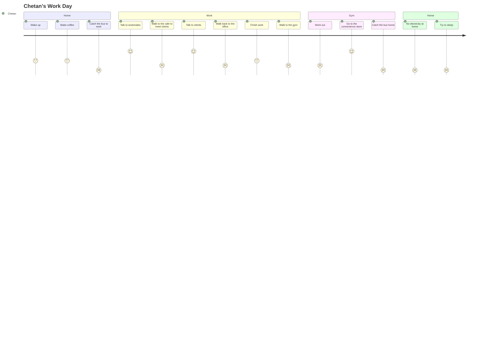

# Empathise 🥺

User-focused thinking of problem spaces and refinement of a problem statement.

## Work Packages 💼

[TOC]

## Brainstorming Problem Areas 🧠

Brainstorm problem areas related to energy, energy harvesting, and energy loss in order to develop a problem statement.

<details><summary>Risks</summary>

- Easy to think too low-level early which will derail the process.
- Large search space can result in too much time used for brainstorming.

</details>

### Energy Types

Brainstormed energy types to set the parameters of the project brief.


### Energy Sources

Brainstormed general sources of energy.


This then expanded to include specific sources of energy focused around energy loss.


## Researching Problem Areas 🧩

Further research into problem areas to:
- Identify the stakeholders within these problem spaces.
- The marketability of the problem.
- Presence of data and previous research.
- The innovativeness of the problem i.e. presence of existing solutions and their innovativeness.

> This work was done within a [Google Doc](https://docs.google.com/document/d/1lhBVNqQttMCyS-LZkeU3rhdo17ehIDjxk5FEoXpYh4c/edit?usp=sharing).

## Evaluating Problem Areas 🤔

Evaluate problem areas to narrow down the problem areas. The deliverable for this work package is a single problem space that the team wants to solve.

<details><summary>Risks</summary>

- Not knowing how to fill out the charts.

</details>

This was a three step process:
1. Identify the selection criteria to measure the problem areas against.
1. Conducting a pair-wise comparison chart to weigh the selection criteria in terms of importance to us.
1. Filling a best-of-class chart to score the problem areas with the selection criteria weighting.

> This work was done within a [Google Sheet](https://docs.google.com/spreadsheets/d/15Y5BLjWYeOzdiXMWd3SZe7I68tTQgj5_khv4GgHinzo/edit?usp=sharing).

## Problem Statement ⁉️

A problem statement sets the objective for the team.

<details><summary>Risks</summary>

- Team not on the same page as the problem statement.

</details>

From the selection of a problem space from the evaluation step, a problem statement was then defined:

> The ever-increasing environmental impact of urban cities is an evolving concern. Worldwide, 1/5 of building energy consumption is air conditioning use - exhausting hot air directly into the atmosphere which is consequently wasted. By capturing and harvesting the energy of the exhausted air, we can reuse the energy to power devices which directly benefit the residents.

## Identifying Stakeholders 👥

Identifying stakeholders is an important first step of user-centred design. It sets the parameters of who to consider when solving the problem.

The identified stakeholders were:
- Building inhabitants.
- Energy consumers.
- Building manager, building owner.
- Environmentalists.
- City planners, council.
- Architects.
- Ventilation companies.

## Creating Personas 👤

After identification of the stakeholders, we expand on who these stakeholders are to make them more relatable to us as people and to the problem.

> This work was done within a [Google Doc](https://docs.google.com/document/d/1QcTmauxbnZnFPAq2-T5k6lEO8NxcR10Ln2A-Wx-NyZU/edit?usp=sharing).

### User Journeys



## User Requirements 🤝

We need to ask our personas:
- What do they want?
- Why do they want it?

User requirements elaborate on what our personas want. The user requirements we use are in the form of user stories because:
```
As a [user], I want to [need], so I can [context]
```

> This work was done within a [Google Doc](https://docs.google.com/document/d/1A06ONjj7tLm_xGvUQfQnWL-As_b0yvIB1bE-RqM8eos/edit?usp=sharing).

## Affinity Map User Requirements to Customer Needs 🗺

For the sake of marks, we're going to map our user requirements to customer needs.
