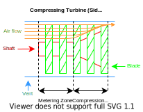
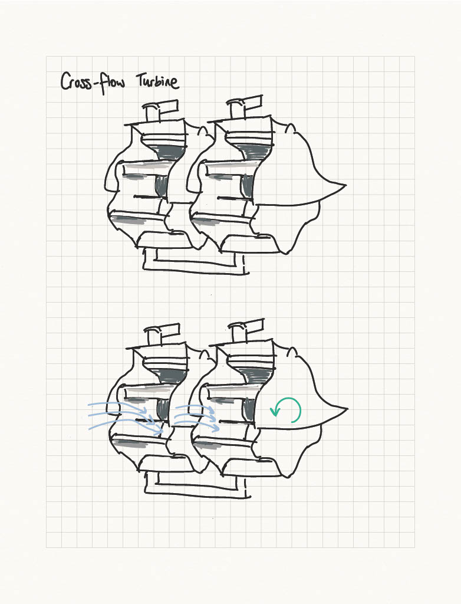
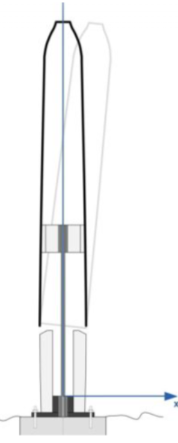

# Ideate 💡

Conceptual generation and evaluation.

## Work Packages 💼

[TOC]

## Concept Generation of Harvesting Solutions 📈

Divergent thinking step to generate as many possible concepts that solves our problem.

A few different methods:
- 6-8-5 Sketch
- Brainstorming
- Crazy 8
- C Sketch

## Concept Evaluation of Harvesting Solutions 📉

Convergent thinking step to evaluate all the generated concepts to select a single concept to focus on for prototyping.

### Selection Criteria

### PCC

### BOC

## Concept Generation of Turbine Solutions 📈

The concept generation method was sketching of turbine solutions.

Dan's sketches:

Court's sketches:

Melissa's sketches:

Catherine's sketches:

Nikki's sketches:

James' sketches:

## Concept Evaluation of Turbine Solutions 📉

### Selection Criteria

The selection criteria for turbine solutions are the functional requirements and constraints.

### PCC

Perform a pair-wise comparison chart to rank the requirements and constraints in terms of importance to us.

### BOC

Scoring the concepts.
