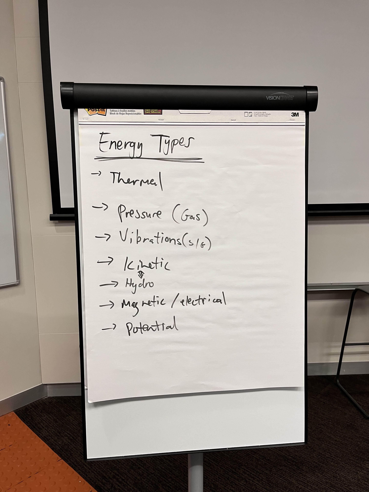
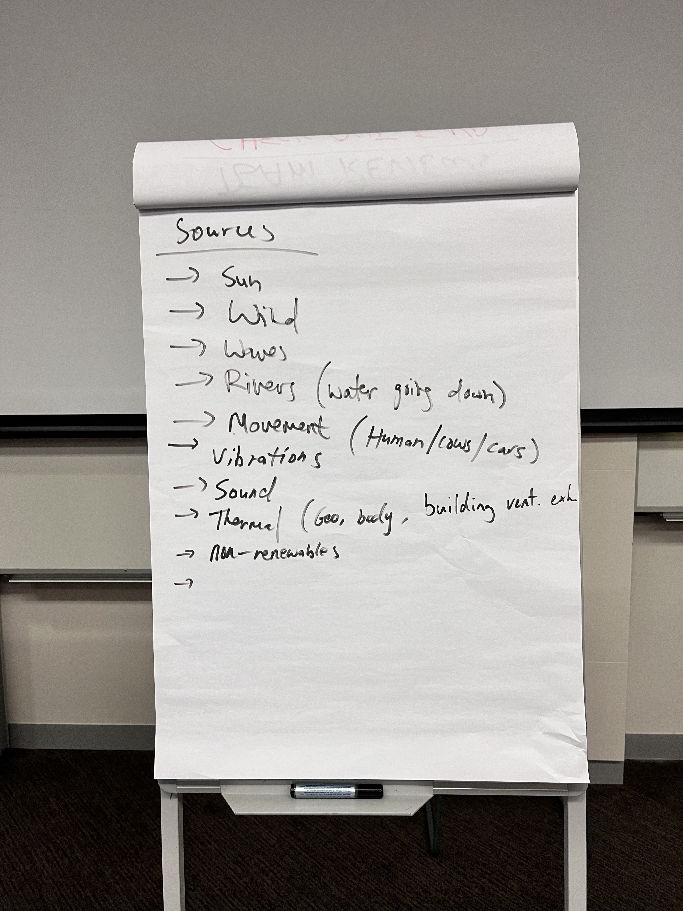

# Meeting 1 - Week 1 Thursday

- **When:** During workshop. (15/9)
- **Where:** At the workshop. (Pioneer Theatre)
- **Chair:** @dennuguyen
- **Scribe:** @jjsnacks

**Attendees:**

- Dan (@dennuguyen)
- Catherine (@catherinecheng02)
- Courtney (@courtzc)
- Etkin (honorary)
- James (@jjsnacks)
- Melissa (@melissathein06)
- Nikki (@nikkifang)

## Team Introductions

We all met and introduced ourselves.

We have in our group:

- Dan (@dennuguyen)
- Catherine (@catherinecheng02)
- Courtney (@courtzc)
- Etkin (honorary)
- James (@jjsnacks)
- Melissa (@melissathein06)
- Nikki (@nikkifang)

Looks like majority MTRN with one AERO.

## GitLab

Everyone was acquainted with GitLab so Dan briefly went over the workflow of managing issues and tasks.

## Roadmap

Discussed the roadmap and was happy with the first couple of stages. (Project Planning, Empathise, Define, Ideate).

Following the criteria to try and get more marks from the marker.

Found out that there is no prototyping, the whole concept needs only to be theoretically verified through simulations / calculations. Though a prototype can be produced but not many (or none) marks are associated with making a working model.

## What's Next

- Start filling out your design journals!
- Think of ideas and brainstorm.
- Explore potential stakeholders and feasibility.

## Brainstorming

We wrote down ideas and discussed possibilities.
Lots of ideas bouncing around which was very nice to see.
Everybody contributed to the discussion as well so very happy about that.

It was understood that we need to 'harvest' energy and turn it into electricity at some point along the process and then deploy it (no requirement to 'accumulate' or store the energy).

**Would like the tutor's confirmation on this.**
