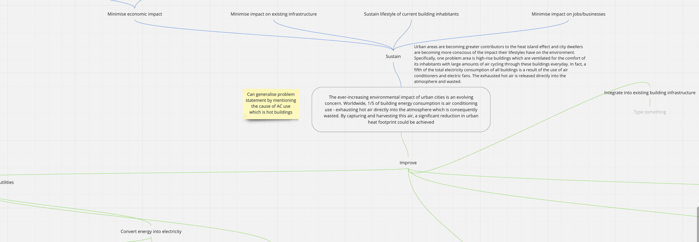

# Meeting 6 - Week 3 Monday

- **When:** 2000 - 2200
- **Where:** MS Teams
- **Chair:** 
- **Scribe:** @dennuguyen 

**Attendees:**
- Dan (@dennuguyen)
- Catherine (@catherinecheng02)
- Courtney (@courtzc)
- Nikki (@nikkifang)
- James (@jjsnacks)
- Melissa (@melissathein06)

## [Affinity Mapping Customer Needs to Functional Requirements](https://miro.com/app/board/uXjVPThrLNQ=/)

From our list of customer needs from this [Google Doc](https://docs.google.com/document/d/1A06ONjj7tLm_xGvUQfQnWL-As_b0yvIB1bE-RqM8eos/edit?usp=sharing), we categorised the customer needs into general requirements. This was the first draft:

We then further refined the affinity map into the following as we fleshed out the categories into root functional requirements:

We added `sustain` and `improve` keyword categories (which is roughly analogous to `design constraints` and `functional requirements`).

## [Functional Hierarchy](https://miro.com/app/board/uXjVPThrLNQ=/)

When the team was happy with the basis of the affinity map, the requirements were translated to a functional hierarchy for decomposition into more descriptive and specific requirements/constraints (note that this image is just a subset of the diagram since it's huge):

- The root node of the functional hierarchy was the problem statement.
- The next level of branching contained `sustain` and `improve`.
- The next level of branching contained the `themes` of the affinity map i.e. the translated customer needs.
- Every level of branching after this were functional requirements or design constraints.

## Actionables

- @jjsnacks
    - [Draft slides](https://gitlab.com/dennuguyen/desn2000/-/issues/49): @all but supervised by @jjsnacks
    - [Develop presentation slides](https://gitlab.com/dennuguyen/desn2000/-/issues/29)
- @courtzc
    - [Finalise problem statement](https://gitlab.com/dennuguyen/desn2000/-/issues/50)
    - [Research and document design constraints](https://gitlab.com/dennuguyen/desn2000/-/issues/45): @jjsnacks is helping
- @catherinecheng02
    - [Further research and document existing solutions](https://gitlab.com/dennuguyen/desn2000/-/issues/42)
- @melissathein06
    - [Define work responsibilities](https://gitlab.com/dennuguyen/desn2000/-/issues/44)
    - [Presentation section for decision process](https://gitlab.com/dennuguyen/desn2000/-/issues/46)
    - [Write project brief interpretation](https://gitlab.com/dennuguyen/desn2000/-/issues/41)
    - [Presentation section for brainstorm](https://gitlab.com/dennuguyen/desn2000/-/issues/32)
- @nikkifang
    - [Presentation section for roadmap](https://gitlab.com/dennuguyen/desn2000/-/issues/26)
    - [Research metrics and finalise functional requirements](https://gitlab.com/dennuguyen/desn2000/-/issues/40): @jjsnacks is helping
- @dennuguyen
    - [Presentation section for affinity map](https://gitlab.com/dennuguyen/desn2000/-/issues/48)
    - [Define user research process](https://gitlab.com/dennuguyen/desn2000/-/issues/47)
    - [Personas](https://gitlab.com/dennuguyen/desn2000/-/issues/20)

We do aim to have a draft of the slides by this Thursday (2022/09/29).

## Next Meeting

The next meetings will be during our workshops when we'll be able to discuss the presentation progress and practice if ready.

We may have non-workshop meeting on Sunday or next Monday depending on progress.
