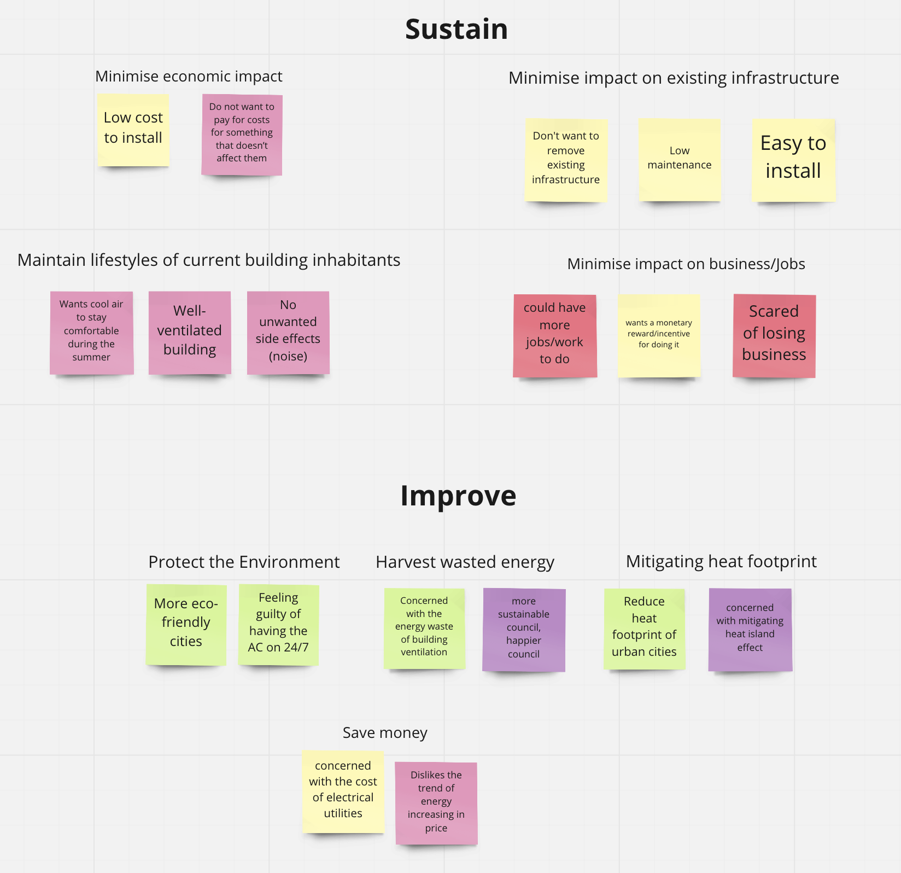

# Meeting 6 - Week 3 Monday

- **When:** 2000 - 2200
- **Where:** MS Teams
- **Chair:** 
- **Scribe:** @dennuguyen 

**Attendees:**
- Dan (@dennuguyen)
- Catherine (@catherinecheng02)
- Courtney (@courtzc)
- Nikki (@nikkifang)
- James (@jjsnacks)
- Melissa (@melissathein06)

## [Affinity Mapping Customer Needs to Functional Requirements](https://miro.com/app/board/uXjVPThrLNQ=/)

From our list of customer needs from this [Google Doc](https://docs.google.com/document/d/1A06ONjj7tLm_xGvUQfQnWL-As_b0yvIB1bE-RqM8eos/edit?usp=sharing), we categorised the customer needs into general requirements. This was the first draft:

We then further refined the affinity map into the following as we fleshed out the categories into root functional requirements:

## [Function Hierarchy](https://miro.com/app/board/uXjVPThrLNQ=/)

## Actionables

- [Draft slides](https://gitlab.com/dennuguyen/desn2000/-/issues/49): @all but supervised by @jjsnacks
- [Finalise problem statement](https://gitlab.com/dennuguyen/desn2000/-/issues/50): @courtzc
- [Presentation section for affinity map](https://gitlab.com/dennuguyen/desn2000/-/issues/48): @dennuguyen
- [Define user research process](https://gitlab.com/dennuguyen/desn2000/-/issues/47): @dennuguyen
- [Presentation section for decision process](https://gitlab.com/dennuguyen/desn2000/-/issues/46): @melissathein06
- [Research and document design constraints](https://gitlab.com/dennuguyen/desn2000/-/issues/45): @courtzc @jjsnacks
- [Further research and document existing solutions](https://gitlab.com/dennuguyen/desn2000/-/issues/42): @catherinecheng02
- [Research metrics and finalise functional requirements](https://gitlab.com/dennuguyen/desn2000/-/issues/40): @nikkifang @jjsnacks
- [Define work responsibilities](https://gitlab.com/dennuguyen/desn2000/-/issues/44): @nikkifang
- [Personas](https://gitlab.com/dennuguyen/desn2000/-/issues/20): @dennuguyen
- [Write project brief interpretation](https://gitlab.com/dennuguyen/desn2000/-/issues/41): @melissathein06
- [Develop presentation slides](https://gitlab.com/dennuguyen/desn2000/-/issues/29): @jjsnacks
- [Presentation section for brainstorm](https://gitlab.com/dennuguyen/desn2000/-/issues/32): @melissathein06
- [Presentation section for roadmap](https://gitlab.com/dennuguyen/desn2000/-/issues/26): @nikkifang

We do aim to have a draft of the slides by Thursday.

## Next Meeting

The next meetings will be during our workshops when we'll be able to discuss the presentation progress and practice if ready.

We may have non-workshop meeting on Sunday or next Monday depending on progress.
