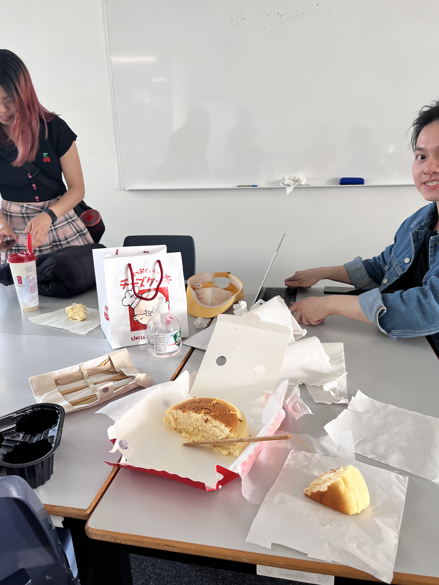
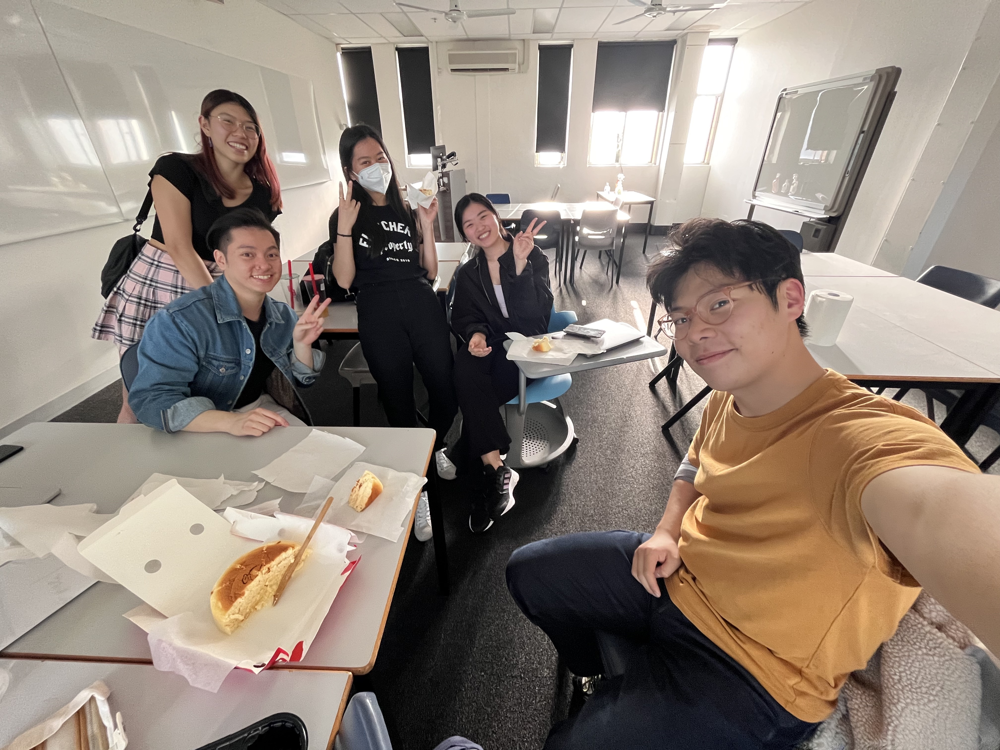

# Meeting 2 - Week 1 Friday

- **When:** During workshop. (16/9)
- **Where:** At the workshop. (Newton 306)
- **Chair:** @dennuguyen
- **Scribe:** @jjsnacks

**Attendees:**

- Dan (@dennuguyen)
- Catherine (@catherinecheng02)
- Courtney (@courtzc)
- James (@jjsnacks)
- Melissa (@melissathein06)
- Nikki (@nikkifang)

## Brainstorming (continued)

We continued to brainstorm ideas and grouped them by source energy type.
Had a few ideas which we thought were 'spicy', them being more marketable and realistic.

Great ideas from everyone!

## Afternoon Tea

Had a very lovely cake, thought I thought the texture was a little wet.

Also, thanks @dennuguyen for the salty tea, which I specifically didn't ask for.

## Actionables

Everyone is given a promising problem to do further research on. Findings will be discussed during the next meeting.

- Dan -> Road heat exchanger.
- Catherine -> Swaying buildings due to wind.
- Courtney -> Sewage flow IOT.
- James -> Building ventilation.
- Melissa -> Typing & Shoes.
- Nikki -> Devices and chargers (electrical appliance?) overheating.
