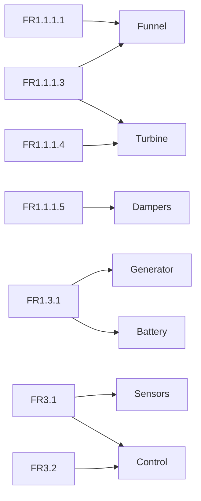

# Prototype 🧱

Building a proof-of-concept.

## Work Packages 💼

[TOC]

- System design.
- Cycle of analysis, CAD, simulation.
- Verify solution works (through analysis and simulation).
- Validate solution against requirements.

## Requirements Allocation 🔑

The requirements to consider for system design were:
- `FR(1.1.1.1)`: Withstand turbulent airflow where Reynolds number ranges from $30000 - 60000$.
- `FR(1.1.1.3)`: Able to operate in air flow between $1400 - 1600 \space L/s$.
- `FR(1.1.1.4)`: Able to operate in speeds between $3 - 5 \space m/s$.
- `FR(1.1.1.5)`: Harvest wind energy with minimal noise pollution.
- `FR(1.3.1)`: Can power electronics at an average power of $3 \space W$.
- `FR(3.1)`: Detect particulates in air.
- `FR(3.2)`: Communicate data.

A requirements allocation was performed to identify the top-level subsystems:

## Maximum Extractable Power ✈

Consider the maximum power that can be extracted from the fluid:
$$
P_{\text{fluid}} = \frac{1}{2} \rho A v^3
$$

Where:
- $P_{\text{fluid}} \space (W)$ is the power of the fluid.
- $rho \space (kg/m^3)$ is the fluid density.
- $A \space (m^2)$ is the cross-sectional surface area that the fluid flows.
- $v \space (m/s)$ is the fluid velocity.

The [range of the fluid velocity](https://www.engineeringtoolbox.com/flow-velocity-air-ducts-d_388.html) is:
$$
\begin{aligned}
v_{\text{min}} &= 5 \space m/s \\
v_{\text{max}} &= 11 \space m/s
\end{aligned}
$$

The fluid density of air is:
$$
\rho = 1.225 \space kg/m^3
$$

Referring to this table of [common rectangular ducts](https://www.engineeringtoolbox.com/rectangular-ducts-d_1010.html), a table of maximum extractable fluid power vs air duct size is created:

<table class="tg">
<thead>
  <tr>
    <th class="tg-amwm" rowspan="2">Width (mm)</th>
    <th class="tg-bobw" colspan="11">Height (mm)</th>
  </tr>
  <tr>
    <th class="tg-bobw">100</th>
    <th class="tg-bobw">150</th>
    <th class="tg-bobw">200</th>
    <th class="tg-bobw">250</th>
    <th class="tg-bobw">300</th>
    <th class="tg-bobw">400</th>
    <th class="tg-bobw">500</th>
    <th class="tg-bobw">600</th>
    <th class="tg-bobw">800</th>
    <th class="tg-bobw">1000</th>
    <th class="tg-bobw">1200</th>
  </tr>
</thead>
<tbody>
  <tr>
    <td class="tg-bobw">200</td>
    <td class="tg-a2dl">1.53</td>
    <td class="tg-ugok">2.30</td>
    <td class="tg-zup4">3.06</td>
    <td class="tg-yrz9">3.83</td>
    <td class="tg-uk67">4.59</td>
    <td class="tg-evjp">6.13</td>
    <td class="tg-ak90">7.66</td>
    <td class="tg-t3zq">9.19</td>
    <td class="tg-h0jm">12.25</td>
    <td class="tg-n8yn">15.31</td>
    <td class="tg-wj4b">18.38</td>
  </tr>
  <tr>
    <td class="tg-bobw">250</td>
    <td class="tg-4smu">1.91</td>
    <td class="tg-f0bb">2.87</td>
    <td class="tg-yrz9">3.83</td>
    <td class="tg-kau8">4.79</td>
    <td class="tg-p9n2">5.74</td>
    <td class="tg-ak90">7.66</td>
    <td class="tg-pw7g">9.57</td>
    <td class="tg-xglf">11.48</td>
    <td class="tg-n8yn">15.31</td>
    <td class="tg-im9s">19.14</td>
    <td class="tg-32si">22.97</td>
  </tr>
  <tr>
    <td class="tg-bobw">300</td>
    <td class="tg-ugok">2.30</td>
    <td class="tg-jwyu">3.45</td>
    <td class="tg-uk67">4.59</td>
    <td class="tg-p9n2">5.74</td>
    <td class="tg-la2o">6.89</td>
    <td class="tg-t3zq">9.19</td>
    <td class="tg-xglf">11.48</td>
    <td class="tg-rk9c">13.78</td>
    <td class="tg-wj4b">18.38</td>
    <td class="tg-32si">22.97</td>
    <td class="tg-g1b3">27.56</td>
  </tr>
  <tr>
    <td class="tg-bobw">400</td>
    <td class="tg-zup4">3.06</td>
    <td class="tg-uk67">4.59</td>
    <td class="tg-evjp">6.13</td>
    <td class="tg-ak90">7.66</td>
    <td class="tg-t3zq">9.19</td>
    <td class="tg-h0jm">12.25</td>
    <td class="tg-n8yn">15.31</td>
    <td class="tg-wj4b">18.38</td>
    <td class="tg-99k1">24.50</td>
    <td class="tg-4zal">30.63</td>
    <td class="tg-cks2">36.75</td>
  </tr>
  <tr>
    <td class="tg-bobw">500</td>
    <td class="tg-yrz9">3.83</td>
    <td class="tg-p9n2">5.74</td>
    <td class="tg-ak90">7.66</td>
    <td class="tg-pw7g">9.57</td>
    <td class="tg-xglf">11.48</td>
    <td class="tg-n8yn">15.31</td>
    <td class="tg-im9s">19.14</td>
    <td class="tg-32si">22.97</td>
    <td class="tg-4zal">30.63</td>
    <td class="tg-6e0j">38.28</td>
    <td class="tg-nabm">45.94</td>
  </tr>
  <tr>
    <td class="tg-bobw">600</td>
    <td class="tg-uk67">4.59</td>
    <td class="tg-la2o">6.89</td>
    <td class="tg-t3zq">9.19</td>
    <td class="tg-xglf">11.48</td>
    <td class="tg-rk9c">13.78</td>
    <td class="tg-wj4b">18.38</td>
    <td class="tg-32si">22.97</td>
    <td class="tg-g1b3">27.56</td>
    <td class="tg-cks2">36.75</td>
    <td class="tg-nabm">45.94</td>
    <td class="tg-ucbw">55.13</td>
  </tr>
  <tr>
    <td class="tg-bobw">800</td>
    <td class="tg-evjp">6.13</td>
    <td class="tg-t3zq">9.19</td>
    <td class="tg-h0jm">12.25</td>
    <td class="tg-n8yn">15.31</td>
    <td class="tg-wj4b">18.38</td>
    <td class="tg-99k1">24.50</td>
    <td class="tg-4zal">30.63</td>
    <td class="tg-cks2">36.75</td>
    <td class="tg-kdq1">49.00</td>
    <td class="tg-jwiq">61.25</td>
    <td class="tg-1gz9">73.50</td>
  </tr>
  <tr>
    <td class="tg-bobw">1000</td>
    <td class="tg-ak90">7.66</td>
    <td class="tg-xglf">11.48</td>
    <td class="tg-n8yn">15.31</td>
    <td class="tg-im9s">19.14</td>
    <td class="tg-32si">22.97</td>
    <td class="tg-4zal">30.63</td>
    <td class="tg-6e0j">38.28</td>
    <td class="tg-nabm">45.94</td>
    <td class="tg-jwiq">61.25</td>
    <td class="tg-wim9">76.56</td>
    <td class="tg-o3vm">91.88</td>
  </tr>
  <tr>
    <td class="tg-bobw">1200</td>
    <td class="tg-t3zq">9.19</td>
    <td class="tg-rk9c">13.78</td>
    <td class="tg-wj4b">18.38</td>
    <td class="tg-32si">22.97</td>
    <td class="tg-g1b3">27.56</td>
    <td class="tg-cks2">36.75</td>
    <td class="tg-nabm">45.94</td>
    <td class="tg-ucbw">55.13</td>
    <td class="tg-1gz9">73.50</td>
    <td class="tg-o3vm">91.88</td>
    <td class="tg-bxtm">110.25</td>
  </tr>
  <tr>
    <td class="tg-bobw">1400</td>
    <td class="tg-1goq">10.72</td>
    <td class="tg-7wv7">16.08</td>
    <td class="tg-i74i">21.44</td>
    <td class="tg-ecwx">26.80</td>
    <td class="tg-al2l">32.16</td>
    <td class="tg-uklj">42.88</td>
    <td class="tg-zy3w">53.59</td>
    <td class="tg-qx7g">64.31</td>
    <td class="tg-1p8w">85.75</td>
    <td class="tg-52o3">107.19</td>
    <td class="tg-5xxj">128.63</td>
  </tr>
  <tr>
    <td class="tg-bobw">1600</td>
    <td class="tg-h0jm">12.25</td>
    <td class="tg-wj4b">18.38</td>
    <td class="tg-99k1">24.50</td>
    <td class="tg-4zal">30.63</td>
    <td class="tg-cks2">36.75</td>
    <td class="tg-kdq1">49.00</td>
    <td class="tg-jwiq">61.25</td>
    <td class="tg-1gz9">73.50</td>
    <td class="tg-saxo">98.00</td>
    <td class="tg-1qvh">122.50</td>
    <td class="tg-2zh6">147.00</td>
  </tr>
  <tr>
    <td class="tg-bobw">1800</td>
    <td class="tg-rk9c">13.78</td>
    <td class="tg-mxkh">20.67</td>
    <td class="tg-g1b3">27.56</td>
    <td class="tg-y7jj">34.45</td>
    <td class="tg-odu0">41.34</td>
    <td class="tg-ucbw">55.13</td>
    <td class="tg-iymw">68.91</td>
    <td class="tg-9ywq">82.69</td>
    <td class="tg-bxtm">110.25</td>
    <td class="tg-542a">137.81</td>
    <td class="tg-zph9">165.38</td>
  </tr>
  <tr>
    <td class="tg-bobw">2000</td>
    <td class="tg-n8yn">15.31</td>
    <td class="tg-32si">22.97</td>
    <td class="tg-4zal">30.63</td>
    <td class="tg-6e0j">38.28</td>
    <td class="tg-nabm">45.94</td>
    <td class="tg-jwiq">61.25</td>
    <td class="tg-wim9">76.56</td>
    <td class="tg-o3vm">91.88</td>
    <td class="tg-1qvh">122.50</td>
    <td class="tg-z7mu">153.13</td>
    <td class="tg-yew5">183.75</td>
  </tr>
</tbody>
</table>

From the requirement of the turbine being operable in duct sizes of at least $400 \space mm \times 400 \space mm$

## Sensor Array Selection ⚡️

> Research on sensors in this [Google Sheet](https://docs.google.com/spreadsheets/d/1f3vsNErERXZ-9NdXlSl-dcCkEAP_58Zadz2kLJG4f4g/edit#gid=0).

## Mechatronic System Design

Consider a gross perspective of possible devices and their power ratings:

<table>
    <tr>
        <th>Device</th>
        <th>Description</th>
        <th>Input Voltage (V)</th>
        <th>Input Current (mA)</th>
    </tr>
    <tr>
        <td><a href="https://store.arduino.cc/products/arduino-nano">Arduino Nano</a></td>
        <td>Microcontroller.</td>
        <td>7 - 12</td>
        <td>20 - 200</td>
    </tr>
    <tr>
        <td><a href="https://docs.arduino.cc/hardware/uno-rev3">Arduino Uno</a></td>
        <td>Microcontroller.</td>
        <td>7 - 12</td>
        <td>50 - 200</td>
    </tr>
    <tr>
        <td><a href="https://www.raspberrypi.com/products/raspberry-pi-4-model-b/specifications/">Raspberry Pi 4</a></td>
        <td>Microcontroller.</td>
        <td>4 - 6</td>
        <td>> 3</td>
    </tr>
    <tr>
        <td><a href="https://en.wikipedia.org/wiki/USB#Low-power_and_high-power_devices">High-Power USB 3.0</a></td>
        <td>To power sensor device.</td>
        <td>5</td>
        <td>900</td>
    </tr>
    <tr>
        <td><a href="https://en.wikipedia.org/wiki/USB#Low-power_and_high-power_devices">USB-C</a></td>
        <td>To power sensor device.</td>
        <td>5</td>
        <td>1500</td>
    </tr>
    <tr>
        <td><a href="https://core-electronics.com.au/wifi-bee-esp8266.html">Wifi Bee ESP8266</a></td>
        <td>Wifi module.</td>
        <td>3.3</td>
        <td>240</td>
    </tr>
    <tr>
        <td><a href="https://core-electronics.com.au/raspberry-pi-pico-w-wireless-wifi.html">Raspberry Pi Pico W</a></td>
        <td>Wifi module.</td>
        <td>1.8 - 5.5</td>
        <td>90</td>
    </tr>
    <tr>
        <td><a href="https://core-electronics.com.au/tinypico-v2-usb-c.html">TinyPICO V2 USB-C</a></td>
        <td>Wifi module.</td>
        <td>1.8 - 5.5</td>
        <td>90</td>
    </tr>
</table>

> Note that a lot of electronic devices can be powered by USB-C.

Consider the formula for electrical power:
$$
P = VI
$$

Where:
- $P \space (W)$ is the power.
- $V \space (V)$ is the voltage.
- $I \space (A)$ is the current.

Power use can be summed from considering the voltage and current ratings of the devices:
$$
\begin{aligned}
P_{\text{net}} &= P_{\text{Arduino Nano}} + P_{\text{USB-C}} + P_{\text{TinyPICO}} \\
&= 7 \times 0.02 + 5 \times 1.5 + 2 \times 0.09 \\
&= 7.82 \space W
\end{aligned}
$$

## Battery Selection 🔋

Consider the battery-life formula:
$$
b = \frac{Q}{I}
$$

Where:
- $b \space (hr)$ is the battery life.
- $Q \space (Ahr)$ is the battery capacity.
- $I \space (A)$ is the current load.

Assume that a small microcontroller, wifi module, and three USB-C devices are powered by the battery, the peak current load would be:
$$
\begin{aligned}
I_{\text{peak}} = 200 + 200 + 1500 \times 3 = 4900 \space mA \approx 4.9 \space A
\end{aligned}
$$

For a desired battery life at the peak current load:
$$
b_{\text{peak}} = 1 \space hr
$$

> 1 hour was selected as the maximum time a routine inspection of air quality could be carried out for.

The desired battery capacity is therefore:
$$
\begin{aligned}
Q &= b_{\text{peak}} \times I_{\text{peak}} \\
&= 1 \times 4.9 \\
&= 4.9 \space Ahr
\end{aligned}
$$

The battery capacity is the standard capacity of most phone-charging powerbanks

In practice, the current load will not be peaked. The current load at rest would realistically be the current draw of the microcontroller:
$$
I_{\text{rest}} = 20 \space mA = 0.02 \space A
$$

> The current draw of a wifi module at rest is $20 \space \mu A$. The sensors may be turned off when not in use.

For a desired battery capacity of $4.9 \space Ahr$, this gives an average battery life of:
$$
b_{\text{rest}} = \frac{Q}{I_{\text{rest}}} = \frac{4.9}{0.02} = 24.5 \space hr
$$

Therefore, any rechargaeable battery that is capable of supplying at least $5 \space V$ and with a capacity of at least $4.9 \space Ahr$ is desired.

> If a battery has greater than $5 \space V$, then a voltage regulator can be used to step-down the voltage.

> If a battery has less than $5 \space V$, then multiple batteries can be placed in series to increase the voltage.

A table of appropriate batteries:
<table>
    <tr>
        <th>Battery</th>
        <th>Type</th>
        <th>Capacity (mAhr)</th>
        <th>Discharge Voltage (V)</th>
        <th>Charge Voltage (V)</th>
        <th>Discharge Rate (C-rate)</th>
        <th>Charge Rate (C-rate)</th>
        <th>Dimensions (mm^3)</th>
        <th>Cycles</th>
    </tr>
    <tr>
        <td><a href="https://www.alibaba.com/product-detail/KC-CE-Certified-Rechargeable-Lithium-Ion_62445223510.html">105075</a></td>
        <td>Lipo</td>
        <td>5000</td>
        <td>3.7</td>
        <td>4.2</td>
        <td>0.2</td>
        <td>0.2</td>
        <td>76 x 50 x 10</td>
        <td></td>
    </tr>
</table>

### Confirm Usability of 105075 Battery

For two 105075 batteries in series, the charging voltage would be $8.4 \space V$ and charge rate is $0.2 \space C$.

The battery life of a single 105075 battery is:
$$
t = \frac{1}{Cr} = \frac{1}{0.2} = 5 \space hr
$$
- $t \space (hr)$ is the battery life.
- $Cr \space (hr^{-1})$ is the C-rate.

Consider Peukert's Law to determine the desired discharge rate:

$$
C_{p} = I^{k}t
$$

Where:
- $C_{p} \space (Ahr)$ is the capacity at one-ampere discharge rate.
- $I \space (Ahr)$ is the actual discharge current.
- $t \space (hr)$ is the time to discharge the battery.
- $k$ is the Peukert constant.

To confirm there is sufficient current to power the system:
$$
\begin{aligned}
0.2 &= I^{1.2} \times 1 \\
I_{\text{max}} &= 8.827 \approx 8.8 \space A > 5 \space A
\end{aligned}
$$

> $k = 1.2$ is very modest for a lithium-ion polymer battery due to its "high" efficiency.

## Turbine Power 💨

> Recall: $P_{\text{fluid}} = \frac{1}{2} \rho A v^3$.

Let the 

Multiply $P_{\text{fluid}}$ by Betz's coefficient to get $P_{\text{turbine}}$

Consider the [extended Bernoulli equation](https://www.engineeringtoolbox.com/mechanical-energy-equation-d_614.html) for a turbine (in terms of energy per unit mass):
$$
E_{\text{pressure, in}} + E_{\text{velocity, in}} + E_{\text{elevation, in}} = E_{\text{pressure, out}} + E_{\text{velocity, out}} + E_{\text{elevation, elevation}} + E_{\text{shaft}} + E_{\text{loss}}
$$

Substituting the energies in terms of velocities and pressures gives:
$$
\frac{p_{\text{in}}}{\rho} + \frac{v_{\text{in}}^2}{2} + gh_{\text{in}} = \frac{p_{\text{out}}}{\rho} + \frac{v_{\text{out}}^2}{2} + gh_{\text{out}} + E_{\text{shaft}} + E_{\text{loss}}
$$

Where:
- $p \space (Pa)$ is the static pressure.
- $\rho \space (kg/m^3)$ is the fluid density.
- $v \space (m/s)$ is the flow velocity.
- $g \space (m/s^2)$ is acceleration of gravity.
- $h \space (m)$ is the elevation height.
- $E_{\text{shaft}} \space (J/kg)$ is the net shaft energy per unit mass for the turbine.
- $E_{\text{loss}} \space (J/kg)$ is the hydraulic loss through the turbine.

This above equation may not be very usable by us so we can multiply it by $\rho$ to get the equation in terms of energy per unit volume:
$$
p_{\text{in}} + \rho \frac{v_{\text{in}}^2}{2} + \gamma h_{\text{in}} = p_{\text{out}} + \rho \frac{v_{\text{out}}^2}{2} + \gamma h_{\text{out}} + \rho E_{\text{shaft}} + \rho E_{\text{loss}}
$$

Where:
- $\rho E_{\text{shaft}} \space (J/m^3)$ is the net shaft energy per unit mass for the turbine.
- $\rho E_{\text{loss}} \space (J/m^3)$ is the hydraulic loss through the turbine.

The fluid density of air is:
$$
\rho = 1.225 \space kg/m^3
$$

The fluid specific weight of air is:
$$
\gamma = \rho \times g = 1.225 \times 9.81 = 12.01725 \space kg/m^3
$$

Consider the efficiency of the turbine:
$$
\eta = \frac{E_{\text{shaft}}}{E_{\text{shaft}} + E_{\text{loss}}}
$$

The [air duct velocity](https://www.engineeringtoolbox.com/flow-velocity-air-ducts-d_388.html) can vary from $5 - 11 m/s$.

## Aerodynamic Performance

Overall turbine torque:
$$
Q = N\overline{F_{t}}R
$$

Total output power:
$$
P_{\text{out}} = Q\omega
$$

Turbine power coefficient:
$$
CP = \frac{2P_{\text{out}}}{\rho A r U_{\infty}^3}
$$

## Rotor Solidity Factor

## Blade Aspect Ratio

## Rotor Swept Area

## Cut-In Wind Speed

Cut-in wind speed is the lowest wind speed for turbine to generate consistent power.

The turbine needs to generate enough starting torque at this wind speed to overcome its inertia.

> In a worst-case scenario, the motor could draw power from the battery to self-start the turbine.

## Cut-Out Wind Speed

Cut-out wind speed is the highest input wind speed that a turbine should generate consistent power for.

## Turbine Configuration ⚙️

Consider the expected air flow range which is:
$$
v = 3 - 4 \space m/s
$$

Consider the efficiency curves of the turbine configurations:

## Turbine Blade Material Selection

## Generator Selection 🚘

Consider the battery-capacity formula:
$$
E = V \times Q
$$

Where:
- $E \space (Whr)$ is the battery energy.
- $V \space (V)$ is the battery voltage.
- $Q \space (Ahr)$ is the battery capacity.

For two 105075 batteries in series, the total battery energy is:
$$
E_{\text{two in-series}} = 2 \times 4.2 \times 5 = 42 \space Whr
$$

For a single 105075 battery, the battery energy is:
$$
E_{\text{single}} = 4.2 \times 5 = 21 \space Whr
$$

Consider the C-rate relationship with current and battery energy:
$$
I = Cr \times E
$$

Where:
- $I \space (A)$ is the current.
- $E \space (Whr)$ is the battery energy.
- $Cr \space (hr^{-1})$ is the C-rate.

The required current to charge the battery can be calculated:
$$
I_{\text{charge}} = Cr \times E_{\text{single}} = 0.2 \times 21 = 4.2 \space A
$$

To select an appropriate generator for two in-series 105075 batteries, the generator needs to supply at least $8.4 \space V$ and $4.2 \space A$. Therefore, the required generator power is:
$$
P = V \times I = 8.4 \times 4.2 = 35.28 \space W
$$

A table of appropriate motors:
<table>
    <tr>
        <th>Motor</th>
        <th></th>
        <th></th>
    </tr>
</table>

Consider the mechanical generated from the turbine:
$$
P = \tau \times \omega
$$
Where:
- $\tau \space (Nm)$ is the torque of the turbine.
- $\omega \space (ms^{-1})$ is the rotational speed of the turbine.

> System design calculations were made in this [Google Sheet](https://docs.google.com/spreadsheets/d/1eosVVQOt2COTTdD-d0bvh6w1MXfZiy1iHKO29cC1Ua0/edit?usp=sharing).

## Bearing Selection 🛞

The expected rotational speed of the turbine is thus:

## Circlip Selection

## Bolt Selection

## Verification

## Validation