# Prototype 🧱

Building a proof-of-concept.

## Work Packages 💼

[TOC]

> System design calculations were made in this [Google Sheet](https://docs.google.com/spreadsheets/d/1eosVVQOt2COTTdD-d0bvh6w1MXfZiy1iHKO29cC1Ua0/edit?usp=sharing).

## Requirements Allocation 🔑

The requirements to consider for system design were:
- `FR(1.1.1.1)`: Withstand turbulent airflow where Reynolds number ranges from $30000 - 60000$.
- `FR(1.1.1.3)`: Able to operate in air flow between $1400 - 1600 \space L/s$.
- `FR(1.1.1.4)`: Able to operate in speeds between $3 - 5 \space m/s$.
- `FR(1.1.1.5)`: Harvest wind energy with minimal noise pollution.
- `FR(1.3.1)`: Can power electronics at an average power of $3 \space W$.
- `FR(3.1)`: Detect particulates in air.
- `FR(3.2)`: Communicate data.

A requirements allocation was performed to identify the top-level subsystems:

## Maximum Extractable Power ✈

Consider the maximum power that can be extracted from the fluid:
$$
P_{\text{fluid}} = \frac{1}{2} \rho A v^3
$$

Where:
- $P_{\text{fluid}} \space (W)$ is the power of the fluid.
- $rho \space (kg/m^3)$ is the fluid density.
- $A \space (m^2)$ is the cross-sectional surface area that the fluid flows.
- $v \space (m/s)$ is the fluid velocity.

The [range of the fluid velocity](https://www.engineeringtoolbox.com/flow-velocity-air-ducts-d_388.html) is:
$$
\begin{aligned}
v_{\min} &= 5 \space m/s \\
v_{\max} &= 11 \space m/s
\end{aligned}
$$

The fluid density of air is:
$$
\rho = 1.225 \space kg/m^3
$$

Referring to this table of [common rectangular ducts](https://www.engineeringtoolbox.com/rectangular-ducts-d_1010.html), a table of maximum extractable fluid power vs air duct size is created:

<table class="tg">
<thead>
  <tr>
    <th class="tg-7btt" rowspan="2">Width (mm)</th>
    <th class="tg-fll5" colspan="11">Height (mm)</th>
  </tr>
  <tr>
    <th class="tg-fll5">100</th>
    <th class="tg-fll5">150</th>
    <th class="tg-fll5">200</th>
    <th class="tg-fll5">250</th>
    <th class="tg-fll5">300</th>
    <th class="tg-fll5">400</th>
    <th class="tg-fll5">500</th>
    <th class="tg-fll5">600</th>
    <th class="tg-fll5">800</th>
    <th class="tg-fll5">1000</th>
    <th class="tg-fll5">1200</th>
  </tr>
</thead>
<tbody>
  <tr>
    <td class="tg-fll5">200</td>
    <td class="tg-fchy">1.53</td>
    <td class="tg-vr9z">2.30</td>
    <td class="tg-4ivf">3.06</td>
    <td class="tg-u0wo">3.83</td>
    <td class="tg-d6lg">4.59</td>
    <td class="tg-06ha">6.13</td>
    <td class="tg-plpd">7.66</td>
    <td class="tg-dfxj">9.19</td>
    <td class="tg-7vq7">12.25</td>
    <td class="tg-f5cs">15.31</td>
    <td class="tg-n0he">18.38</td>
  </tr>
  <tr>
    <td class="tg-fll5">250</td>
    <td class="tg-nn8n">1.91</td>
    <td class="tg-n6dw">2.87</td>
    <td class="tg-u0wo">3.83</td>
    <td class="tg-4vur">4.79</td>
    <td class="tg-fbrj">5.74</td>
    <td class="tg-plpd">7.66</td>
    <td class="tg-pmy1">9.57</td>
    <td class="tg-6shm">11.48</td>
    <td class="tg-f5cs">15.31</td>
    <td class="tg-30wt">19.14</td>
    <td class="tg-em69">22.97</td>
  </tr>
  <tr>
    <td class="tg-fll5">300</td>
    <td class="tg-vr9z">2.30</td>
    <td class="tg-lq5z">3.45</td>
    <td class="tg-d6lg">4.59</td>
    <td class="tg-fbrj">5.74</td>
    <td class="tg-wt7h">6.89</td>
    <td class="tg-dfxj">9.19</td>
    <td class="tg-6shm">11.48</td>
    <td class="tg-pd65">13.78</td>
    <td class="tg-n0he">18.38</td>
    <td class="tg-em69">22.97</td>
    <td class="tg-vwkk">27.56</td>
  </tr>
  <tr>
    <td class="tg-fll5">400</td>
    <td class="tg-4ivf">3.06</td>
    <td class="tg-d6lg">4.59</td>
    <td class="tg-06ha">6.13</td>
    <td class="tg-plpd">7.66</td>
    <td class="tg-dfxj">9.19</td>
    <td class="tg-7vq7">12.25</td>
    <td class="tg-f5cs">15.31</td>
    <td class="tg-n0he">18.38</td>
    <td class="tg-ljj2">24.50</td>
    <td class="tg-x1n4">30.63</td>
    <td class="tg-twob">36.75</td>
  </tr>
  <tr>
    <td class="tg-fll5">500</td>
    <td class="tg-u0wo">3.83</td>
    <td class="tg-fbrj">5.74</td>
    <td class="tg-plpd">7.66</td>
    <td class="tg-pmy1">9.57</td>
    <td class="tg-6shm">11.48</td>
    <td class="tg-f5cs">15.31</td>
    <td class="tg-30wt">19.14</td>
    <td class="tg-em69">22.97</td>
    <td class="tg-x1n4">30.63</td>
    <td class="tg-q0ei">38.28</td>
    <td class="tg-vg9x">45.94</td>
  </tr>
  <tr>
    <td class="tg-fll5">600</td>
    <td class="tg-d6lg">4.59</td>
    <td class="tg-wt7h">6.89</td>
    <td class="tg-dfxj">9.19</td>
    <td class="tg-6shm">11.48</td>
    <td class="tg-pd65">13.78</td>
    <td class="tg-n0he">18.38</td>
    <td class="tg-em69">22.97</td>
    <td class="tg-vwkk">27.56</td>
    <td class="tg-twob">36.75</td>
    <td class="tg-vg9x">45.94</td>
    <td class="tg-qgp5">55.13</td>
  </tr>
  <tr>
    <td class="tg-fll5">800</td>
    <td class="tg-06ha">6.13</td>
    <td class="tg-dfxj">9.19</td>
    <td class="tg-7vq7">12.25</td>
    <td class="tg-f5cs">15.31</td>
    <td class="tg-n0he">18.38</td>
    <td class="tg-ljj2">24.50</td>
    <td class="tg-x1n4">30.63</td>
    <td class="tg-twob">36.75</td>
    <td class="tg-kpva">49.00</td>
    <td class="tg-1yt7">61.25</td>
    <td class="tg-dzpk">73.50</td>
  </tr>
  <tr>
    <td class="tg-fll5">1000</td>
    <td class="tg-plpd">7.66</td>
    <td class="tg-6shm">11.48</td>
    <td class="tg-f5cs">15.31</td>
    <td class="tg-30wt">19.14</td>
    <td class="tg-em69">22.97</td>
    <td class="tg-x1n4">30.63</td>
    <td class="tg-q0ei">38.28</td>
    <td class="tg-vg9x">45.94</td>
    <td class="tg-1yt7">61.25</td>
    <td class="tg-f2ym">76.56</td>
    <td class="tg-6qrj">91.88</td>
  </tr>
  <tr>
    <td class="tg-fll5">1200</td>
    <td class="tg-dfxj">9.19</td>
    <td class="tg-pd65">13.78</td>
    <td class="tg-n0he">18.38</td>
    <td class="tg-em69">22.97</td>
    <td class="tg-vwkk">27.56</td>
    <td class="tg-twob">36.75</td>
    <td class="tg-vg9x">45.94</td>
    <td class="tg-qgp5">55.13</td>
    <td class="tg-dzpk">73.50</td>
    <td class="tg-6qrj">91.88</td>
    <td class="tg-zj55">110.25</td>
  </tr>
  <tr>
    <td class="tg-fll5">1400</td>
    <td class="tg-88pj">10.72</td>
    <td class="tg-ccbk">16.08</td>
    <td class="tg-rcvj">21.44</td>
    <td class="tg-dqzg">26.80</td>
    <td class="tg-clww">32.16</td>
    <td class="tg-97r8">42.88</td>
    <td class="tg-0495">53.59</td>
    <td class="tg-okop">64.31</td>
    <td class="tg-v8nh">85.75</td>
    <td class="tg-lt8a">107.19</td>
    <td class="tg-jsqk">128.63</td>
  </tr>
  <tr>
    <td class="tg-fll5">1600</td>
    <td class="tg-7vq7">12.25</td>
    <td class="tg-n0he">18.38</td>
    <td class="tg-ljj2">24.50</td>
    <td class="tg-x1n4">30.63</td>
    <td class="tg-twob">36.75</td>
    <td class="tg-kpva">49.00</td>
    <td class="tg-1yt7">61.25</td>
    <td class="tg-dzpk">73.50</td>
    <td class="tg-9d2x">98.00</td>
    <td class="tg-mf1y">122.50</td>
    <td class="tg-b1z7">147.00</td>
  </tr>
  <tr>
    <td class="tg-fll5">1800</td>
    <td class="tg-pd65">13.78</td>
    <td class="tg-st3g">20.67</td>
    <td class="tg-vwkk">27.56</td>
    <td class="tg-kegi">34.45</td>
    <td class="tg-d411">41.34</td>
    <td class="tg-qgp5">55.13</td>
    <td class="tg-ylbp">68.91</td>
    <td class="tg-090p">82.69</td>
    <td class="tg-zj55">110.25</td>
    <td class="tg-ewaz">137.81</td>
    <td class="tg-3io6">165.38</td>
  </tr>
  <tr>
    <td class="tg-fll5">2000</td>
    <td class="tg-f5cs">15.31</td>
    <td class="tg-em69">22.97</td>
    <td class="tg-x1n4">30.63</td>
    <td class="tg-q0ei">38.28</td>
    <td class="tg-vg9x">45.94</td>
    <td class="tg-1yt7">61.25</td>
    <td class="tg-f2ym">76.56</td>
    <td class="tg-6qrj">91.88</td>
    <td class="tg-mf1y">122.50</td>
    <td class="tg-kp2v">153.13</td>
    <td class="tg-j1aw">183.75</td>
  </tr>
</tbody>
</table>

To get the maximum ideal turbine power, the maximum extractable fluid power is multiplied by [Betz's coefficient](https://en.wikipedia.org/wiki/Betz%27s_law):
$$
P_{\text{turbine, ideal}} = \frac{16}{27} \times P_{\text{fluid}}
$$

The following table shows the maximum effective turbine power vs air duct sizes:

<table class="tg">
<thead>
  <tr>
    <th class="tg-7btt" rowspan="2">Width (mm)</th>
    <th class="tg-fll5" colspan="11">Height (mm)</th>
  </tr>
  <tr>
    <th class="tg-fll5">100</th>
    <th class="tg-fll5">150</th>
    <th class="tg-fll5">200</th>
    <th class="tg-fll5">250</th>
    <th class="tg-fll5">300</th>
    <th class="tg-fll5">400</th>
    <th class="tg-fll5">500</th>
    <th class="tg-fll5">600</th>
    <th class="tg-fll5">800</th>
    <th class="tg-fll5">1000</th>
    <th class="tg-fll5">1200</th>
  </tr>
</thead>
<tbody>
  <tr>
    <td class="tg-fll5">200</td>
    <td class="tg-fchy">0.91</td>
    <td class="tg-420o">1.36</td>
    <td class="tg-n6dw">1.81</td>
    <td class="tg-dffa">2.27</td>
    <td class="tg-xocn">2.72</td>
    <td class="tg-yqa5">3.63</td>
    <td class="tg-km6z">4.54</td>
    <td class="tg-23jy">5.44</td>
    <td class="tg-zxyu">7.26</td>
    <td class="tg-iind">9.07</td>
    <td class="tg-ng3h">10.89</td>
  </tr>
  <tr>
    <td class="tg-fll5">250</td>
    <td class="tg-nn8n">1.13</td>
    <td class="tg-evn7">1.70</td>
    <td class="tg-dffa">2.27</td>
    <td class="tg-lhc5">2.84</td>
    <td class="tg-qfjg">3.40</td>
    <td class="tg-km6z">4.54</td>
    <td class="tg-dwsa">5.67</td>
    <td class="tg-xxoq">6.81</td>
    <td class="tg-iind">9.07</td>
    <td class="tg-41kv">11.34</td>
    <td class="tg-bbni">13.61</td>
  </tr>
  <tr>
    <td class="tg-fll5">300</td>
    <td class="tg-420o">1.36</td>
    <td class="tg-4ivf">2.04</td>
    <td class="tg-xocn">2.72</td>
    <td class="tg-qfjg">3.40</td>
    <td class="tg-ris1">4.08</td>
    <td class="tg-23jy">5.44</td>
    <td class="tg-xxoq">6.81</td>
    <td class="tg-f38b">8.17</td>
    <td class="tg-ng3h">10.89</td>
    <td class="tg-bbni">13.61</td>
    <td class="tg-em69">16.33</td>
  </tr>
  <tr>
    <td class="tg-fll5">400</td>
    <td class="tg-n6dw">1.81</td>
    <td class="tg-xocn">2.72</td>
    <td class="tg-yqa5">3.63</td>
    <td class="tg-km6z">4.54</td>
    <td class="tg-23jy">5.44</td>
    <td class="tg-zxyu">7.26</td>
    <td class="tg-iind">9.07</td>
    <td class="tg-ng3h">10.89</td>
    <td class="tg-kicr">14.52</td>
    <td class="tg-ljj2">18.15</td>
    <td class="tg-zsud">21.78</td>
  </tr>
  <tr>
    <td class="tg-fll5">500</td>
    <td class="tg-dffa">2.27</td>
    <td class="tg-qfjg">3.40</td>
    <td class="tg-km6z">4.54</td>
    <td class="tg-dwsa">5.67</td>
    <td class="tg-xxoq">6.81</td>
    <td class="tg-iind">9.07</td>
    <td class="tg-41kv">11.34</td>
    <td class="tg-bbni">13.61</td>
    <td class="tg-ljj2">18.15</td>
    <td class="tg-z7se">22.69</td>
    <td class="tg-gi6p">27.22</td>
  </tr>
  <tr>
    <td class="tg-fll5">600</td>
    <td class="tg-xocn">2.72</td>
    <td class="tg-ris1">4.08</td>
    <td class="tg-23jy">5.44</td>
    <td class="tg-xxoq">6.81</td>
    <td class="tg-f38b">8.17</td>
    <td class="tg-ng3h">10.89</td>
    <td class="tg-bbni">13.61</td>
    <td class="tg-em69">16.33</td>
    <td class="tg-zsud">21.78</td>
    <td class="tg-gi6p">27.22</td>
    <td class="tg-502n">32.67</td>
  </tr>
  <tr>
    <td class="tg-fll5">800</td>
    <td class="tg-yqa5">3.63</td>
    <td class="tg-23jy">5.44</td>
    <td class="tg-zxyu">7.26</td>
    <td class="tg-iind">9.07</td>
    <td class="tg-ng3h">10.89</td>
    <td class="tg-kicr">14.52</td>
    <td class="tg-ljj2">18.15</td>
    <td class="tg-zsud">21.78</td>
    <td class="tg-wlh0">29.04</td>
    <td class="tg-97r8">36.30</td>
    <td class="tg-kpva">43.56</td>
  </tr>
  <tr>
    <td class="tg-fll5">1000</td>
    <td class="tg-km6z">4.54</td>
    <td class="tg-xxoq">6.81</td>
    <td class="tg-iind">9.07</td>
    <td class="tg-41kv">11.34</td>
    <td class="tg-bbni">13.61</td>
    <td class="tg-ljj2">18.15</td>
    <td class="tg-z7se">22.69</td>
    <td class="tg-gi6p">27.22</td>
    <td class="tg-97r8">36.30</td>
    <td class="tg-styj">45.37</td>
    <td class="tg-9rct">54.44</td>
  </tr>
  <tr>
    <td class="tg-fll5">1200</td>
    <td class="tg-23jy">5.44</td>
    <td class="tg-f38b">8.17</td>
    <td class="tg-ng3h">10.89</td>
    <td class="tg-bbni">13.61</td>
    <td class="tg-em69">16.33</td>
    <td class="tg-zsud">21.78</td>
    <td class="tg-gi6p">27.22</td>
    <td class="tg-502n">32.67</td>
    <td class="tg-kpva">43.56</td>
    <td class="tg-9rct">54.44</td>
    <td class="tg-zokr">65.33</td>
  </tr>
  <tr>
    <td class="tg-fll5">1400</td>
    <td class="tg-556u">6.35</td>
    <td class="tg-d65n">9.53</td>
    <td class="tg-zlag">12.70</td>
    <td class="tg-qw0s">15.88</td>
    <td class="tg-hn99">19.06</td>
    <td class="tg-t5db">25.41</td>
    <td class="tg-q0ei">31.76</td>
    <td class="tg-5bhf">38.11</td>
    <td class="tg-dfko">50.81</td>
    <td class="tg-ylbp">63.52</td>
    <td class="tg-lljt">76.22</td>
  </tr>
  <tr>
    <td class="tg-fll5">1600</td>
    <td class="tg-zxyu">7.26</td>
    <td class="tg-ng3h">10.89</td>
    <td class="tg-kicr">14.52</td>
    <td class="tg-ljj2">18.15</td>
    <td class="tg-zsud">21.78</td>
    <td class="tg-wlh0">29.04</td>
    <td class="tg-97r8">36.30</td>
    <td class="tg-kpva">43.56</td>
    <td class="tg-1xgm">58.07</td>
    <td class="tg-2vc3">72.59</td>
    <td class="tg-an1c">87.11</td>
  </tr>
  <tr>
    <td class="tg-fll5">1800</td>
    <td class="tg-f38b">8.17</td>
    <td class="tg-lj0t">12.25</td>
    <td class="tg-em69">16.33</td>
    <td class="tg-9upn">20.42</td>
    <td class="tg-x1n4">24.50</td>
    <td class="tg-502n">32.67</td>
    <td class="tg-zcjq">40.83</td>
    <td class="tg-ucyy">49.00</td>
    <td class="tg-zokr">65.33</td>
    <td class="tg-v8nh">81.67</td>
    <td class="tg-6euf">98.00</td>
  </tr>
  <tr>
    <td class="tg-fll5">2000</td>
    <td class="tg-iind">9.07</td>
    <td class="tg-bbni">13.61</td>
    <td class="tg-ljj2">18.15</td>
    <td class="tg-z7se">22.69</td>
    <td class="tg-gi6p">27.22</td>
    <td class="tg-97r8">36.30</td>
    <td class="tg-styj">45.37</td>
    <td class="tg-9rct">54.44</td>
    <td class="tg-2vc3">72.59</td>
    <td class="tg-f3sz">90.74</td>
    <td class="tg-0mk6">108.89</td>
  </tr>
</tbody>
</table>

> [Betz's Law](https://en.wikipedia.org/wiki/Betz%27s_law) states that no turbine can capture more than 59.3% of the kinetic energy of the wind.

## Funnel Design 🗻

The fluid velocity can be accelerated by using a funnel:
$$
A_1 v_1 = A_2 v_2
$$

Where:
- $A_1 \space (m^2)$ is the cross-sectional area at the start of the funnel.
- $v_1 \space (m/s)$ is the fluid velocity at the start of the funnel.
- $A_2 \space (m^2)$ is the cross-sectional area at the end of the funnel.
- $v_2 \space (m/s)$ is the fluid velocity at the end of the funnel.

To accelerate the incoming air by a factor of $2$, the following ratio must be observed:
$$
\frac{A_1}{A_2} = \frac{w_1 \times h_1}{w_2 \times h_2} = 2 \\
$$

Let the height of the funnel start be:
$$
h_1 = 0.2 \space m
$$

The height of the turbine is the height of the funnel end:
$$
h_2 = 0.175 \space m
$$

The width of the funnel start can be determined by the diameter of the base of the assembly.

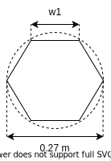

$$
w_1 = \frac{0.27}{2} = 0.135 \space m
$$

Round down $w_1$ to account for the thickness of the material:
$$
w_1 = 0.13 \space m
$$

Therefore:
$$
w_2 = \frac{w_1 \times h_1}{2 \times h_2} = \frac{0.13 \times 0.2}{2 \times 0.175} = 0.074 \space m
$$

The range of fluid velocity after acceleration is therefore:
$$
\begin{aligned}
v_{\min} &= 10 \space m/s \\
v_{\max} &= 22 \space m/s \\
\end{aligned}
$$

## Turbine Selection 💨

Consider the power coefficient formula for a turbine:
$$
C_p = \frac{P_{\text{out}}}{\frac{1}{2} \rho A v^3}
$$

Where:
- $C_p \space (\text{dimensionless})$ is the power coefficient of the turbine.
- $P_{\text{out}} \space (W)$ is the output power of the turbine.
- $\rho \space (kg/m^3)$ is the fluid density.
- $A \space (m^2)$ is the vertical cross-sectional area of the turbine.
- $v \space (m/s^2)$ is the fluid velocity.

This [paper](https://www.semanticscholar.org/paper/DESIGN-AND-ANALYSIS-OF-VERTICAL-AXIS-WIND-TURBINE-Mazari-Hussain/6f794a50c037165bc87163648b25e4ac56998c72) provides an experimentally-obtained power coefficient for a two-bladed spiral vertical wind-air turbine:
$$
C_p = 0.25
$$

Assume the radius of the turbine is:
$$
R = 0.1 \space m
$$

Assume the vertical cross-sectional area of the turbine is:
$$
A = 0.175 \times 0.2 = 0.035 \space m^2
$$

The range of wind speed for turbine operation is:
$$
v = [10, 22] \space m/s
$$

For the minimum wind speed, the minimum output power can be calculated:
$$
\begin{aligned}
C_p &= \frac{P_{\text{out, min}}}{\frac{1}{2} \rho A v^3} \\
0.25 &= \frac{P_{\text{out, min}}}{\frac{1}{2} \times 1.225 \times 0.035 \times 10^3} \\
\therefore P_{\text{out, min}} &= 5.56 \space W
\end{aligned}
$$

For the maximum wind speed, the maximum output power can be calculated:
$$
\begin{aligned}
C_p &= \frac{P_{\text{out, max}}}{\frac{1}{2} \rho A v^3} \\
0.25 &= \frac{P_{\text{out, max}}}{\frac{1}{2} \times 1.225 \times 0.035 \times 22^3} \\
\therefore P_{\text{out, max}} &= 57.07 \space W
\end{aligned}
$$

Consider the relationship between turbine velocity and tip speed ratio:
$$
\lambda = \frac{v}{\omega R}
\omega = \frac{\lambda v}{R}
$$

Where:
- $\omega \space (rad/s)$ is the turbine angular velocity.
- $v \space (m/s)$ is the fluid velocity.
- $\lambda \space (\text{dimensionless})$ is the tip speed ratio.
- $R \space (m)$ is the radius of the turbine.

The tip speed ratio is a constant factor which relates the fluid velocity to the turbine rotational velocity. For a two-bladed spiral vertial wind-air turbine with a power coefficient of $0.25$, the tip speed ratio is:
$$
\lambda = 0.55
$$

The minimum turbine rotational velocity is:
$$
\begin{aligned}
\omega_{\min} &= \frac{\lambda v_{\min}}{R} \\
&= \frac{0.55 \times 10}{0.1} \\
&= 55 \space rad/s \space (525 \space RPM)
\end{aligned}
$$

The maximum turbine rotational velocity is:
$$
\begin{aligned}
\omega_{\max} &= \frac{\lambda v_{\max}}{R} \\
&= \frac{0.55 \times 22}{0.1} \\
&= 121 \space rad/s \space (1155 \space RPM)
\end{aligned}
$$

The relationship between output power and torque is:
$$
P = Q\omega
$$

Where:
- $P \space (W)$ is the turbine power.
- $Q \space (Nm)$ is the turbine torque.
- $\omega \space (rad/s)$ is the turbine rotational velocity.

The minimum turbine torque is therefore:
$$
\begin{aligned}
P_{\min} &= Q_{\min} \omega_{\min} \\
5.56 &= Q_{\min} \times 55 \\
\therefore Q_{\min} &= 0.101 \space Nm
\end{aligned}
$$

The maximum turbine torque is therefore:
$$
\begin{aligned}
P_{\max} &= Q_{\max} \omega_{\max} \\
57.07 &= Q_{\max} \times 121 \\
\therefore Q_{\max} &= 0.472 \space Nm
\end{aligned}
$$

## Turbine Blade Material Selection 🍯

For a [two blade vertical wind-air turbine](https://www.semanticscholar.org/paper/DESIGN-AND-ANALYSIS-OF-VERTICAL-AXIS-WIND-TURBINE-Mazari-Hussain/6f794a50c037165bc87163648b25e4ac56998c72), the force acting on the turbine for a wind speed of $22 \space m/s$ is:
$$
\begin{aligned}
P_{\text{fluid, max}} &= F_{\text{fluid, max}}v_{\text{fluid, max}} \\
57.07 &= F_{\text{fluid, max}} \times 22 \\
\therefore F_{\text{fluid, max}} &= 2.59 \space N
\end{aligned}
$$

The turbine blade area can be obtained from the Solidworks measurement tool:
$$
A_{\text{blade}} = 20000 \space mm^2 = 0.02 \space m^2
$$

Therefore, the maximum pressure that can be applied to the blade is:
$$
P = \frac{F}{A} = \frac{2.59}{0.02} = 129.5 \space Pa
$$

The applied pressure is so insignificant that material selection can be done qualitatively i.e. based on material properties.

<!-- 
Treat the maximum allowable pressure to be the Young's modulus of the material i.e. the pressure applied to the material before it deforms. The Ashby chart for Young's modulus vs density is used to select the turbine blade material. A material with the lowest density is desired to reduce the inertia of the system to reduce the cut-in wind speed. -->

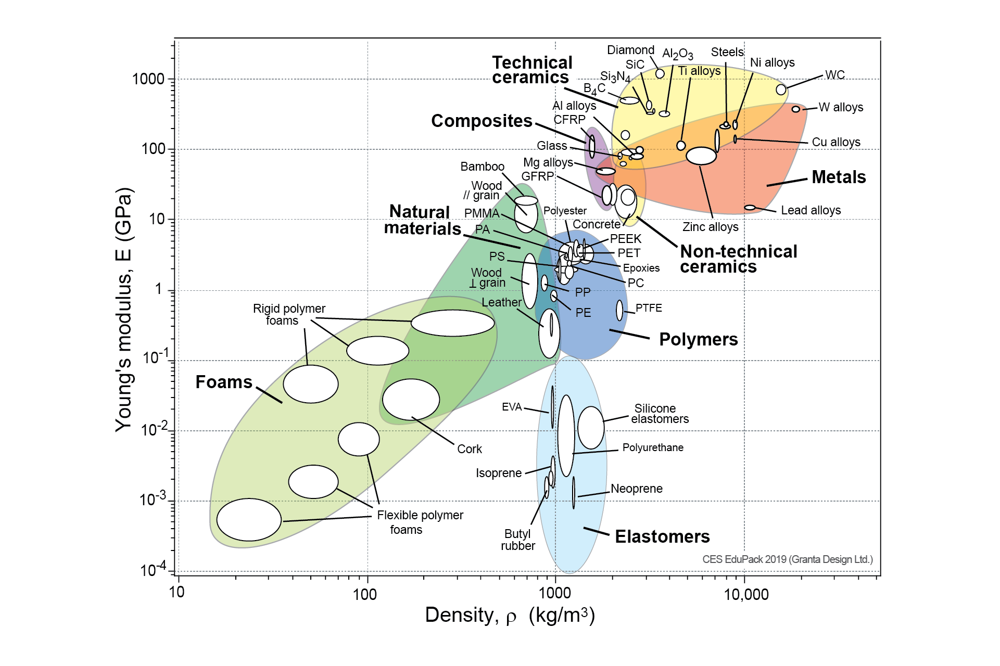

<table>
    <tr>
        <th>Material</th>
        <th>Density</th>
        <th>Cost</th>
    </tr>
    <tr>
        <td>Aluminium</td>
        <td></td>
        <td></td>
    </tr>
    <tr>
        <td>ABS</td>
        <td></td>
        <td></td>
    </tr>
    <tr>
        <td>HDPE</td>
        <td></td>
        <td></td>
    </tr>
    <tr>
        <td>PVC</td>
        <td></td>
        <td></td>
    </tr>
</table>

The selected turbine blade material is HDPE.

Assume the Young's modulus of HDPE is:
$$
E_{\text{HDPE}} = 1400 \space MPa
$$

## Factor of Safety

Let the force applied on the turbine by the fluid be:
$$
F_{\text{fluid, safe}} = 10 \space N
$$

This gives a factor of safety of:
$$
FOS = \frac{F_{\text{fluid, safe}}}{F_{\text{fluid, max}}} = \frac{10}{2.59} = 3.86
$$

This factor of safety is greater than the [recommended factor of safety of $3$](https://www.engineeringtoolbox.com/factors-safety-fos-d_1624.html) for the rotor components of a turbine.

All subsequent FEAs assume a fluid force of $10 \space N$ is applied unless otherwise specified.

## Circlip Selection 📎

Consider the modulus of elasticity:
$$
\lambda = \frac{\sigma}{\epsilon}
$$

Where:
- $\lambda \space (Pa)$ is the modulus of elasticity.
- $\sigma \space (Pa)$ is the stress.
- $\epsilon \space (\text{dimensionless})$ is the strain.

A finite-element analysis is performed on the turbine shaft to give a stress and strain plot. The greatest stress and strain experienced by the turbine shaft occurs at the circlip groove.

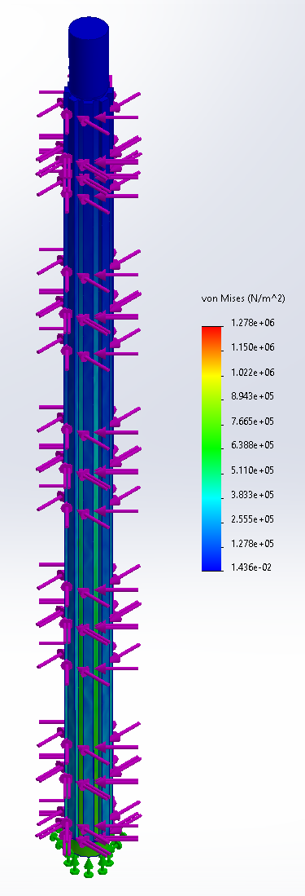
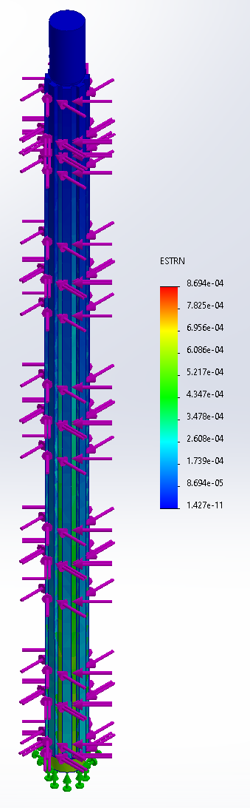

The modulus of elasticity for a $8 \space mm$ outer diameter shaft is:
$$
\lambda = \frac{1.278 \times 10^6}{8.694 \times 10^{-4}} = 1467 \space MPa > E_{\text{HDPE}}
$$

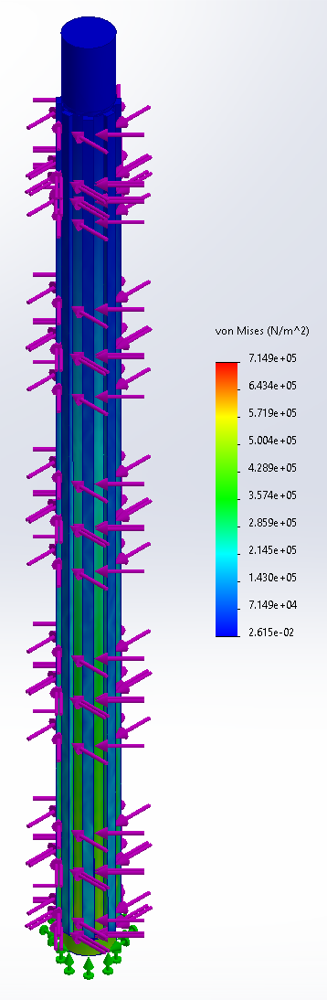
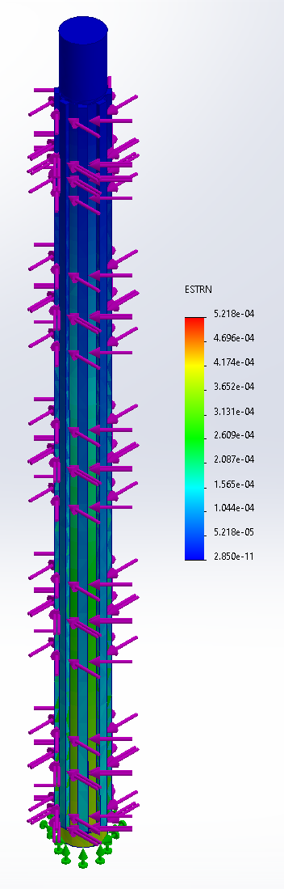

The modulus of elasticity for a $10 \space mm$ outer diameter shaft is:
$$
\lambda = \frac{7.149 \times 10^5}{5.218 \times 10^{-4}} = 1370 \space MPa < E_{\text{HDPE}}
$$

> Clearly since the circlip is steel, the shaft will fail before the circlip will fail.

The [selected circlip (BS3673)](https://au.rs-online.com/web/p/circlips/0289231) is an external steel circlip for a $10 \space mm$ shaft for a $9.6 \space mm$ groove.

## Turbine Blade Design 🔪

FEA was performed on the turbine blade to simulate the stress and strain experienced by a $10 \space N$ fluid impacting a blade. The part was fixed at the internal shaft.

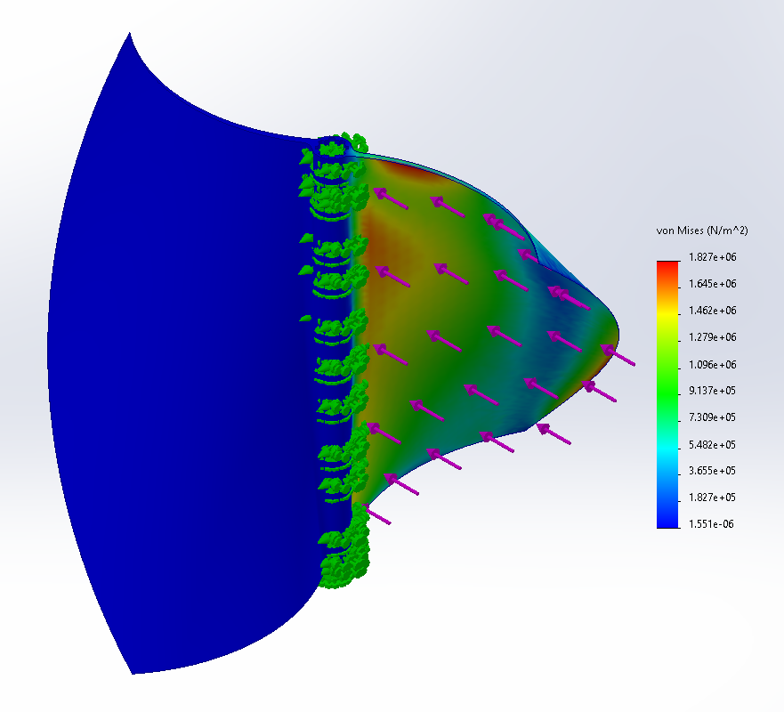
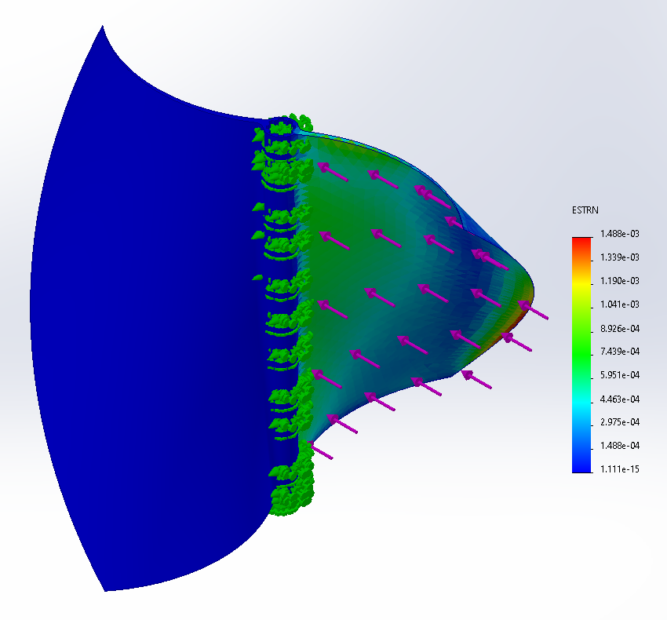

The modulus of elasticity for a turbine blade with a base width of $3 \space mm$ is:
$$
\lambda = \frac{1.827 \times 10^6}{1.488 \times 10^{-3}} = 1228 \space MPa < E_{\text{HDPE}}
$$

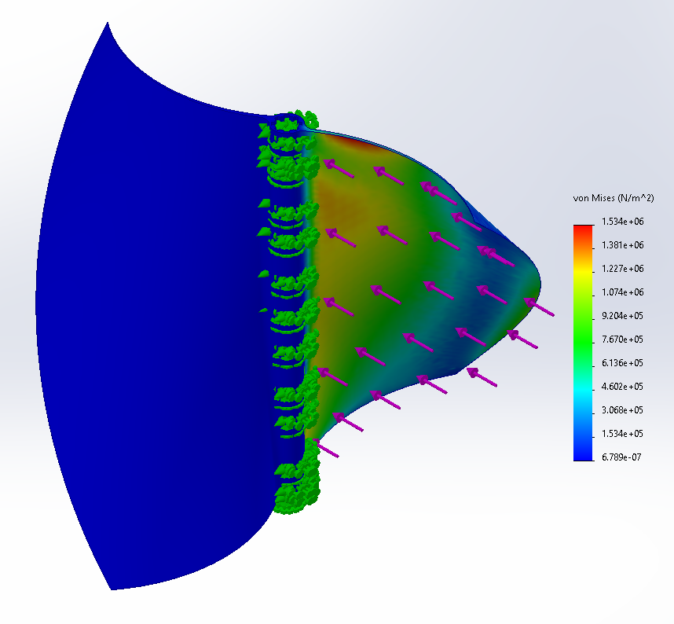
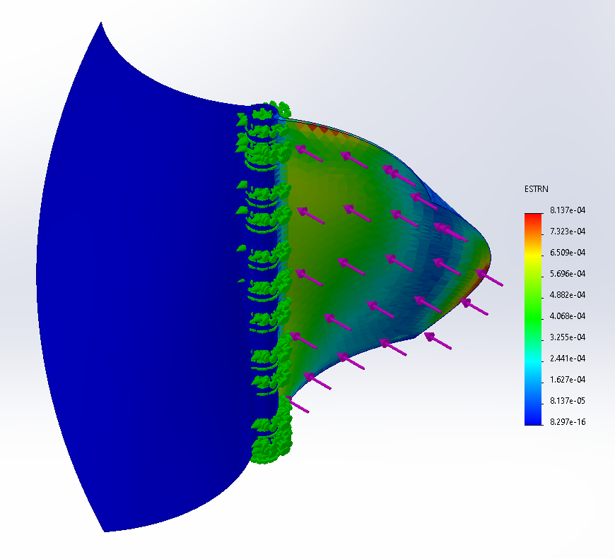

The modulus of elasticity for a turbine blade with a base width of $2 \space mm$ is:
$$
\lambda = \frac{1.534 \times 10^6}{8.137 \times 10^{-4}} = 1885 \space MPa > E_{\text{HDPE}}
$$

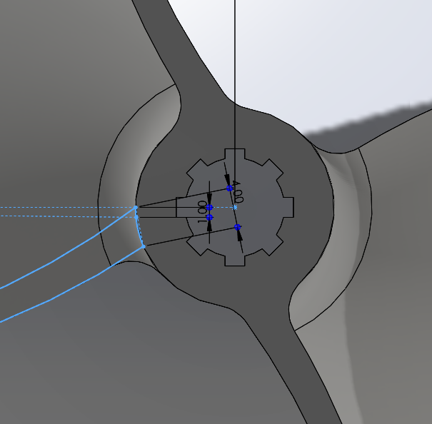
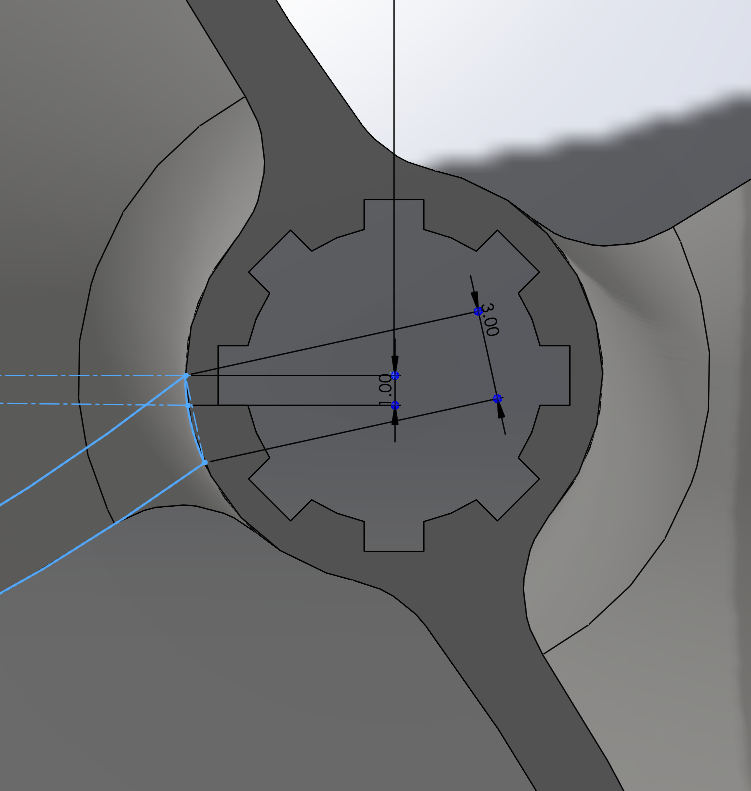

The mass of the turbine was reduced from an initial mass of $95.56 \space g$ to $56.52 \space g$.

## Bearing Selection 🐻

> Reminder that the max turbine torque is $0.472 \space Nm$ and max turbine rotational velocity is $1155 \space RPM$.

The required inner diameter of the bearing is $10 \space mm$ to fasten the turbine shaft.

The outer diameter of the inner race must also be greater than the diameter of the circlip to avoid stator and rotor parts of the turbine from interfering. Therefore, any bearing with an outer diameter less than $20 \space mm$ is not suitable.

A table of appropriate bearings:
<table>
    <tr>
        <th>Bearing</th>
        <th>Type</th>
        <th>Inner diameter (mm)</th>
        <th>Outer diameter (mm)</th>
        <th>Static Load Rating (N)</th>
        <th>Dynamic Load Rating (N)</th>
        <th>Cost (AUD)</th>
    </tr>
    <tr>
        <td><a href="https://au.rs-online.com/web/p/ball-bearings/6189979">6800-2RS</a></td>
        <td>Ball</td>
        <td>10</td>
        <td>19</td>
        <td>585</td>
        <td>1380</td>
        <td>5.35</td>
    </tr>
    <tr>
        <td><a href="https://au.rs-online.com/web/p/ball-bearings/6126057">R-2210X2DDRA1P25LY121</a></td>
        <td>Ball</td>
        <td>10</td>
        <td>22</td>
        <td>1273</td>
        <td>2679</td>
        <td>9.645</td>
    </tr>
    <tr>
        <td><a href="https://au.rs-online.com/web/p/ball-bearings/6189991">6000-2RS</a></td>
        <td>Ball</td>
        <td>10</td>
        <td>26</td>
        <td>1960</td>
        <td>4620</td>
        <td>6.13</td>
    </tr>
    <tr>
        <td><a href="https://au.rs-online.com/web/p/ball-bearings/6189985">6200-2RS</a></td>
        <td>Ball</td>
        <td>10</td>
        <td>30</td>
        <td>2360</td>
        <td>5070</td>
        <td>6.13</td>
    </tr>
</table>

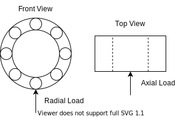

Calculating equivalent dynamic bearing load:
$$
P = xF_r + yF_a
$$

Where:
- $x$ is the radial load factor.
- $y$ is the axial load factor.
- $F_r \space (N)$ is the actual radial bearing load.
- $F_a \space (N)$ is the actual axial bearing load.

For a deep groove ball bearing type, the load factors are:
$$
\begin{aligned}
x &= 1, \space y = 0 \text{ for } \frac{F_a}{F_r} \leq 0.5 \\
x &= 0.56, \space y = [1, 2] \text{ for } \frac{F_a}{F_r} > 0.5 \\
\end{aligned}
$$

The actual radial bearing load is at worst the torque transferred from the turbine:
$$
\begin{aligned}
F_r &= \frac{\tau_{\text{turbine}}}{r_{\text{bearing}}} \\
&= \frac{0.472}{19 \times 10^{-3}} \\
&= 24.84 \space N
\end{aligned}
$$

The actual axial bearing load is theoretically the turbine weight (because the turbine is drag-based and ideally no lift is generated):
$$
\begin{aligned}
F_a &= m_{\text{turbine + shaft}} \times g \\
&= (56.52 + 17.51) \times 10^{-3} \times 9.81 \\
&= 0.73 \space N
\end{aligned}
$$

The axial load to radial load ratio is:
$$
\frac{F_a}{F_r} = \frac{0.73}{24.84} \approx 0.03
$$

Therefore, the selected load factors are:
$$
x = 1, \space y = 0
$$

The equivalent dynamic bearing load is:
$$
\begin{aligned}
P &= xF_r + yF_a \\
&= 1 \times 24.84 + 0 \times 0.73 \\
&= 24.84 \space N
\end{aligned}
$$

Consider the bearing life:
$$
L_{10} = \left(\frac{C}{P}\right)^a
$$

Where:
- $L \space (10^6 \space \text{revolutions})$ is the bearing life in number of revolutions.
- $C \space (N)$ is the dynamic load rating.
- $P \space (N)$ is the equivalent dynamic load rating.
- $a \space (\text{dimensionless})$ is the bearing type factor.

For the [6800-2RS](https://au.rs-online.com/web/p/ball-bearings/6189979), the bearing life is:
$$
\begin{aligned}
L_{10} &= \left(\frac{C_{6800-2RS}}{P}\right)^a \\ 
&= \left(\frac{585}{24.84}\right)^3 \\
&= 13062 \times 10^6 \text{ revolutions} \\
\end{aligned}
$$

To calculate the bearing life in hours:
$$
L_{10h} = \frac{10^6}{60\omega}L_{10}
$$

Where:
- $L_{10h} \space (hr)$ is the bearing life in hours.
- $\omega \space (RPM)$ is the rotational speed.
- $L_{10} \space (10^6 \text{revolutiosn})$ is the bearing life in number of revolutions.

$$
\begin{aligned}
L_{10h} &= \frac{10^6}{60\omega}L_{10} \\
&= \frac{10^6}{60 \times 577.7} \times 13062 \\
&= 376839 \space hr \\
&\approx 43 \space \text{years}
\end{aligned}
$$

## Spline Design 🦔

The axial force acting on the spline is the weight of the rotor components itself i.e.
$$
F_{\text{axial, max}} = m_{\text{turbine + shaft}} \times g = 0.73 \space N
$$

Let the axial force applied on the turbine be:
$$
F_{\text{axial, safe}} = 3 \space N
$$

This gives a factor of safety of:
$$
FOS = \frac{F_{\text{axial, safe}}}{F_{\text{axial, max}}} = \frac{3}{0.73} = 4.11
$$

Let the spline width be $2 \space mm$ and height be $1 \space mm$.

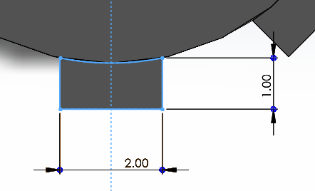

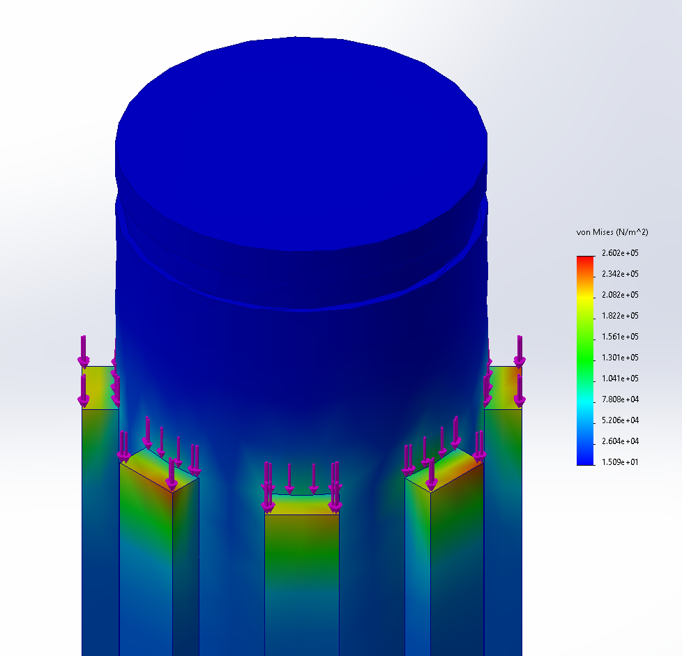
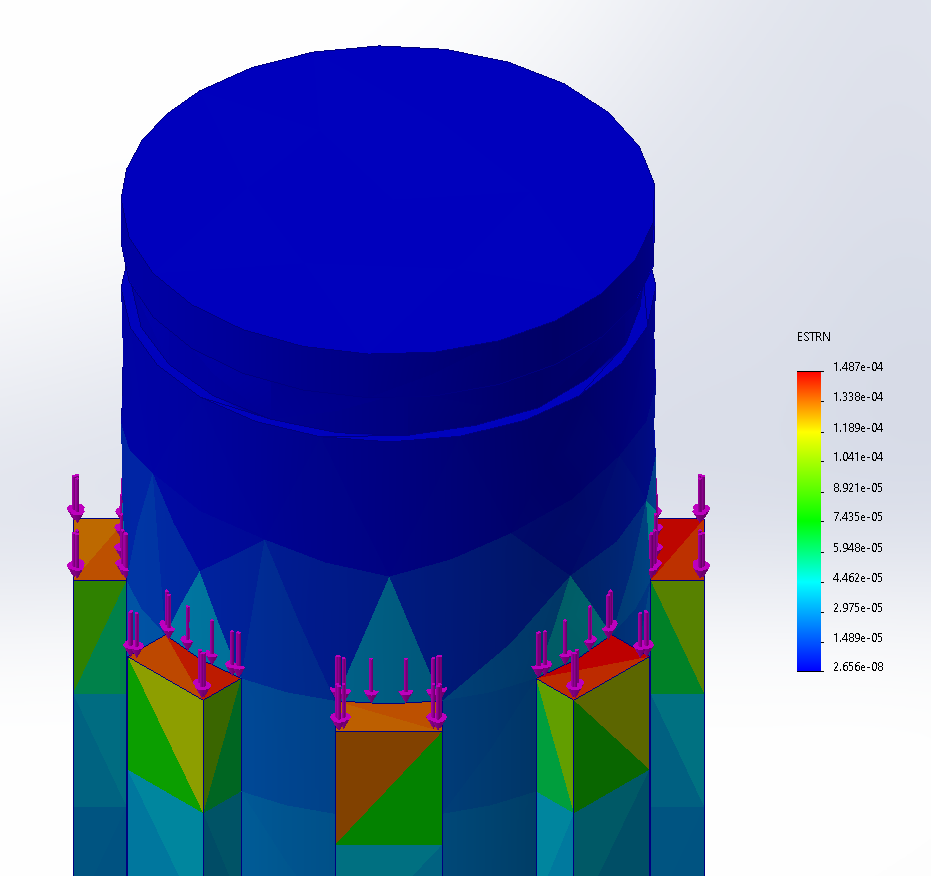

The modulus of elasticity of the spline acting as a shoulder for the bearing is:
$$
\lambda = \frac{2.602 \times 10^5}{1.407 \times 10^{-4}} = 1849 \space MPa > E_{\text{HDPE}}
$$

It is clear from the FEA that the most stress is applied on the corner of the spline, therefore a chamfer is applied.

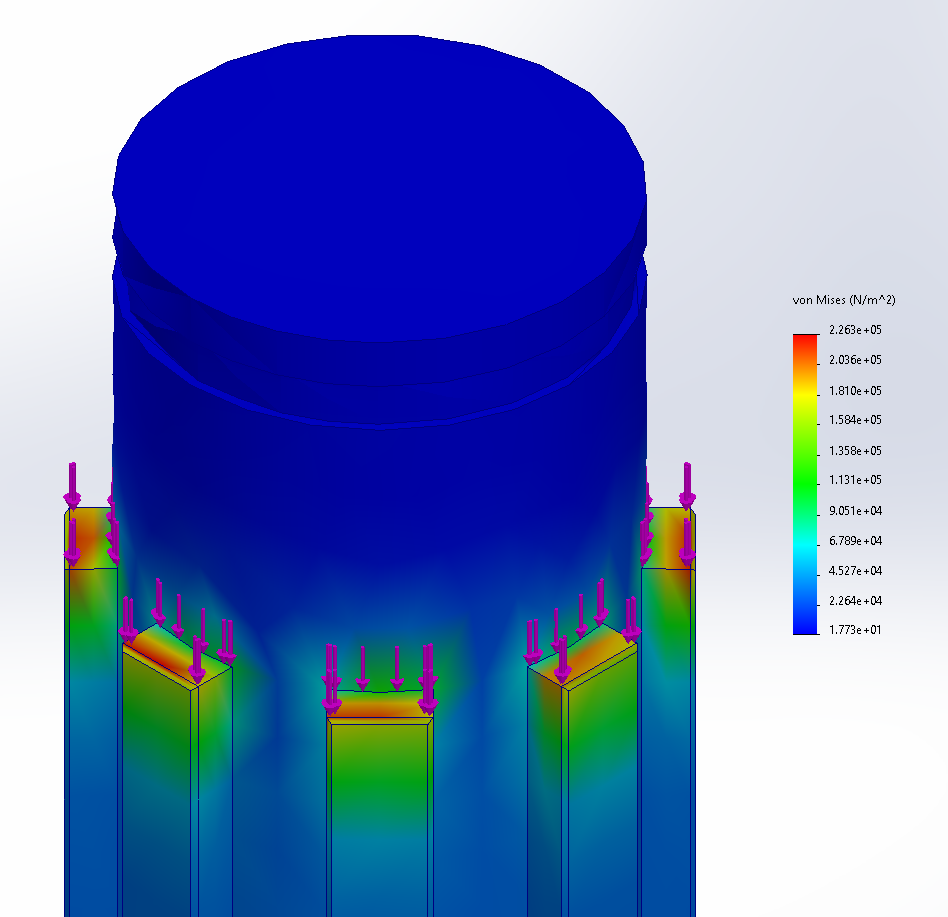
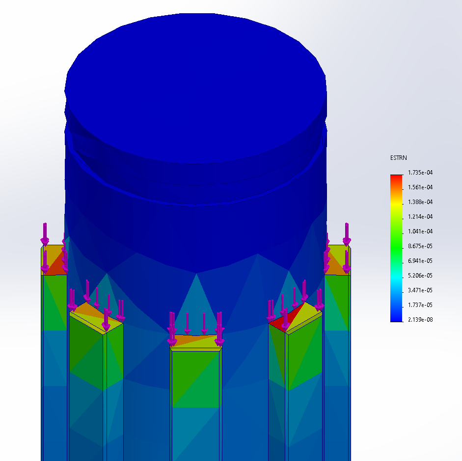

The modulus of elasticity of the spline acting as a shoulder for the bearing is:
$$
\lambda = \frac{2.263 \times 10^5}{1.735 \times 10^{-4}} = 1304 \space MPa < E_{\text{HDPE}}
$$

## Bolt Selection 🔩

A finite-element analysis of the turbine assembly is done to identify the region of highest stress at the mating points between parts.

Consider the possible failure modes of bolting at this mating point.

This will determine the metric bolt size which will be uniform throughout the entire assembly for ease of assembly.

## Sensor Array Selection ⚡️

> Research on sensors in this [Google Sheet](https://docs.google.com/spreadsheets/d/1f3vsNErERXZ-9NdXlSl-dcCkEAP_58Zadz2kLJG4f4g/edit#gid=0).

## Mechatronic System Power Requirements 🤖

Consider a gross perspective of possible devices and their power ratings:

<table>
    <tr>
        <th>Device</th>
        <th>Description</th>
        <th>Input Voltage (V)</th>
        <th>Input Current (mA)</th>
    </tr>
    <tr>
        <td><a href="https://store.arduino.cc/products/arduino-nano">Arduino Nano</a></td>
        <td>Microcontroller.</td>
        <td>7 - 12</td>
        <td>20 - 200</td>
    </tr>
    <tr>
        <td><a href="https://docs.arduino.cc/hardware/uno-rev3">Arduino Uno</a></td>
        <td>Microcontroller.</td>
        <td>7 - 12</td>
        <td>50 - 200</td>
    </tr>
    <tr>
        <td><a href="https://www.raspberrypi.com/products/raspberry-pi-4-model-b/specifications/">Raspberry Pi 4</a></td>
        <td>Microcontroller.</td>
        <td>4 - 6</td>
        <td>> 3</td>
    </tr>
    <tr>
        <td><a href="https://en.wikipedia.org/wiki/USB#Low-power_and_high-power_devices">High-Power USB 3.0</a></td>
        <td>To power sensor device.</td>
        <td>5</td>
        <td>900</td>
    </tr>
    <tr>
        <td><a href="https://en.wikipedia.org/wiki/USB#Low-power_and_high-power_devices">USB-C</a></td>
        <td>To power sensor device.</td>
        <td>5</td>
        <td>1500</td>
    </tr>
    <tr>
        <td><a href="https://core-electronics.com.au/wifi-bee-esp8266.html">Wifi Bee ESP8266</a></td>
        <td>Wifi module.</td>
        <td>3.3</td>
        <td>240</td>
    </tr>
    <tr>
        <td><a href="https://core-electronics.com.au/raspberry-pi-pico-w-wireless-wifi.html">Raspberry Pi Pico W</a></td>
        <td>Wifi module.</td>
        <td>1.8 - 5.5</td>
        <td>90</td>
    </tr>
    <tr>
        <td><a href="https://core-electronics.com.au/tinypico-v2-usb-c.html">TinyPICO V2 USB-C</a></td>
        <td>Wifi module.</td>
        <td>1.8 - 5.5</td>
        <td>90</td>
    </tr>
</table>

> Note that a lot of electronic devices can be powered by USB-C.

Consider the formula for electrical power:
$$
P = VI
$$

Where:
- $P \space (W)$ is the power.
- $V \space (V)$ is the voltage.
- $I \space (A)$ is the current.

An efficient mechatronic system would only allow a single sensor device to be enabled at a time (with the microcontroller and wifi module enabled as well). Power use can be summed from considering the voltage and current ratings of the devices:
$$
\begin{aligned}
P_{\text{mechatronic system}} &= P_{\text{Arduino Nano}} + P_{\text{USB-C}} + P_{\text{TinyPICO}} \\
&= 7 \times 0.02 + 5 \times 1.5 + 2 \times 0.09 \\
&= 7.82 \space W
\end{aligned}
$$

Compare this power requirement to the table of maximum effective turbine powers (red cells are nonviable to power a turbine, green cells are viable):

<table class="tg">
<thead>
  <tr>
    <th class="tg-7btt" rowspan="2">Width (mm)</th>
    <th class="tg-fll5" colspan="11">Height (mm)</th>
  </tr>
  <tr>
    <th class="tg-fll5">100</th>
    <th class="tg-fll5">150</th>
    <th class="tg-fll5">200</th>
    <th class="tg-fll5">250</th>
    <th class="tg-fll5">300</th>
    <th class="tg-fll5">400</th>
    <th class="tg-fll5">500</th>
    <th class="tg-fll5">600</th>
    <th class="tg-fll5">800</th>
    <th class="tg-fll5">1000</th>
    <th class="tg-fll5">1200</th>
  </tr>
</thead>
<tbody>
  <tr>
    <td class="tg-fll5">200</td>
    <td class="tg-y9p2">0.91</td>
    <td class="tg-y9p2">1.36</td>
    <td class="tg-y9p2">1.81</td>
    <td class="tg-y9p2">2.27</td>
    <td class="tg-y9p2">2.72</td>
    <td class="tg-y9p2">3.63</td>
    <td class="tg-y9p2">4.54</td>
    <td class="tg-y9p2">5.44</td>
    <td class="tg-y9p2">7.26</td>
    <td class="tg-kd2b">9.07</td>
    <td class="tg-kd2b">10.89</td>
  </tr>
  <tr>
    <td class="tg-fll5">250</td>
    <td class="tg-y9p2">1.13</td>
    <td class="tg-y9p2">1.70</td>
    <td class="tg-y9p2">2.27</td>
    <td class="tg-y9p2">2.84</td>
    <td class="tg-y9p2">3.40</td>
    <td class="tg-y9p2">4.54</td>
    <td class="tg-y9p2">5.67</td>
    <td class="tg-y9p2">6.81</td>
    <td class="tg-kd2b">9.07</td>
    <td class="tg-kd2b">11.34</td>
    <td class="tg-kd2b">13.61</td>
  </tr>
  <tr>
    <td class="tg-fll5">300</td>
    <td class="tg-y9p2">1.36</td>
    <td class="tg-y9p2">2.04</td>
    <td class="tg-y9p2">2.72</td>
    <td class="tg-y9p2">3.40</td>
    <td class="tg-y9p2">4.08</td>
    <td class="tg-y9p2">5.44</td>
    <td class="tg-y9p2">6.81</td>
    <td class="tg-kd2b">8.17</td>
    <td class="tg-kd2b">10.89</td>
    <td class="tg-kd2b">13.61</td>
    <td class="tg-kd2b">16.33</td>
  </tr>
  <tr>
    <td class="tg-fll5">400</td>
    <td class="tg-y9p2">1.81</td>
    <td class="tg-y9p2">2.72</td>
    <td class="tg-y9p2">3.63</td>
    <td class="tg-y9p2">4.54</td>
    <td class="tg-y9p2">5.44</td>
    <td class="tg-y9p2">7.26</td>
    <td class="tg-kd2b">9.07</td>
    <td class="tg-kd2b">10.89</td>
    <td class="tg-kd2b">14.52</td>
    <td class="tg-kd2b">18.15</td>
    <td class="tg-kd2b">21.78</td>
  </tr>
  <tr>
    <td class="tg-fll5">500</td>
    <td class="tg-y9p2">2.27</td>
    <td class="tg-y9p2">3.40</td>
    <td class="tg-y9p2">4.54</td>
    <td class="tg-y9p2">5.67</td>
    <td class="tg-y9p2">6.81</td>
    <td class="tg-kd2b">9.07</td>
    <td class="tg-kd2b">11.34</td>
    <td class="tg-kd2b">13.61</td>
    <td class="tg-kd2b">18.15</td>
    <td class="tg-kd2b">22.69</td>
    <td class="tg-kd2b">27.22</td>
  </tr>
  <tr>
    <td class="tg-fll5">600</td>
    <td class="tg-y9p2">2.72</td>
    <td class="tg-y9p2">4.08</td>
    <td class="tg-y9p2">5.44</td>
    <td class="tg-y9p2">6.81</td>
    <td class="tg-kd2b">8.17</td>
    <td class="tg-kd2b">10.89</td>
    <td class="tg-kd2b">13.61</td>
    <td class="tg-kd2b">16.33</td>
    <td class="tg-kd2b">21.78</td>
    <td class="tg-kd2b">27.22</td>
    <td class="tg-kd2b">32.67</td>
  </tr>
  <tr>
    <td class="tg-fll5">800</td>
    <td class="tg-y9p2">3.63</td>
    <td class="tg-y9p2">5.44</td>
    <td class="tg-y9p2">7.26</td>
    <td class="tg-kd2b">9.07</td>
    <td class="tg-kd2b">10.89</td>
    <td class="tg-kd2b">14.52</td>
    <td class="tg-kd2b">18.15</td>
    <td class="tg-kd2b">21.78</td>
    <td class="tg-kd2b">29.04</td>
    <td class="tg-kd2b">36.30</td>
    <td class="tg-kd2b">43.56</td>
  </tr>
  <tr>
    <td class="tg-fll5">1000</td>
    <td class="tg-y9p2">4.54</td>
    <td class="tg-y9p2">6.81</td>
    <td class="tg-kd2b">9.07</td>
    <td class="tg-kd2b">11.34</td>
    <td class="tg-kd2b">13.61</td>
    <td class="tg-kd2b">18.15</td>
    <td class="tg-kd2b">22.69</td>
    <td class="tg-kd2b">27.22</td>
    <td class="tg-kd2b">36.30</td>
    <td class="tg-kd2b">45.37</td>
    <td class="tg-kd2b">54.44</td>
  </tr>
  <tr>
    <td class="tg-fll5">1200</td>
    <td class="tg-y9p2">5.44</td>
    <td class="tg-kd2b">8.17</td>
    <td class="tg-kd2b">10.89</td>
    <td class="tg-kd2b">13.61</td>
    <td class="tg-kd2b">16.33</td>
    <td class="tg-kd2b">21.78</td>
    <td class="tg-kd2b">27.22</td>
    <td class="tg-kd2b">32.67</td>
    <td class="tg-kd2b">43.56</td>
    <td class="tg-kd2b">54.44</td>
    <td class="tg-kd2b">65.33</td>
  </tr>
  <tr>
    <td class="tg-fll5">1400</td>
    <td class="tg-y9p2">6.35</td>
    <td class="tg-kd2b">9.53</td>
    <td class="tg-kd2b">12.70</td>
    <td class="tg-kd2b">15.88</td>
    <td class="tg-kd2b">19.06</td>
    <td class="tg-kd2b">25.41</td>
    <td class="tg-kd2b">31.76</td>
    <td class="tg-kd2b">38.11</td>
    <td class="tg-kd2b">50.81</td>
    <td class="tg-kd2b">63.52</td>
    <td class="tg-kd2b">76.22</td>
  </tr>
  <tr>
    <td class="tg-fll5">1600</td>
    <td class="tg-y9p2">7.26</td>
    <td class="tg-kd2b">10.89</td>
    <td class="tg-kd2b">14.52</td>
    <td class="tg-kd2b">18.15</td>
    <td class="tg-kd2b">21.78</td>
    <td class="tg-kd2b">29.04</td>
    <td class="tg-kd2b">36.30</td>
    <td class="tg-kd2b">43.56</td>
    <td class="tg-kd2b">58.07</td>
    <td class="tg-kd2b">72.59</td>
    <td class="tg-kd2b">87.11</td>
  </tr>
  <tr>
    <td class="tg-fll5">1800</td>
    <td class="tg-kd2b">8.17</td>
    <td class="tg-kd2b">12.25</td>
    <td class="tg-kd2b">16.33</td>
    <td class="tg-kd2b">20.42</td>
    <td class="tg-kd2b">24.50</td>
    <td class="tg-kd2b">32.67</td>
    <td class="tg-kd2b">40.83</td>
    <td class="tg-kd2b">49.00</td>
    <td class="tg-kd2b">65.33</td>
    <td class="tg-kd2b">81.67</td>
    <td class="tg-kd2b">98.00</td>
  </tr>
  <tr>
    <td class="tg-fll5">2000</td>
    <td class="tg-kd2b">9.07</td>
    <td class="tg-kd2b">13.61</td>
    <td class="tg-kd2b">18.15</td>
    <td class="tg-kd2b">22.69</td>
    <td class="tg-kd2b">27.22</td>
    <td class="tg-kd2b">36.30</td>
    <td class="tg-kd2b">45.37</td>
    <td class="tg-kd2b">54.44</td>
    <td class="tg-kd2b">72.59</td>
    <td class="tg-kd2b">90.74</td>
    <td class="tg-kd2b">108.89</td>
  </tr>
</tbody>
</table>

## Battery Selection 🔋

The mechatronic system will draw a current at most:
$$
\begin{aligned}
I_{\text{effective}} = 20 + 1500 + 90 = 1610 \space mA \approx 1.61 \space A
\end{aligned}
$$

When the system is at "rest", the current load would realistically be the current draw of the microcontroller:
$$
I_{\text{rest}} = 20 \space mA = 0.02 \space A
$$

> The current draw of a wifi module at rest is $20 \space \mu A$. The sensors may be turned off when not in use.

### Discharge Current Constraint

The effective discharge current should not be more than $1/10$ of the rated capacity:
$$
\begin{aligned}
I_{\text{effective}} &= \frac{1}{10} \times Q \\
1.61 &= \frac{1}{10} \times Q \\
\therefore Q &= 16.1 \space A \\
\end{aligned}
$$

### Effective Battery Capacity

The battery's effective capacity is $2/3$ of its rated capacity:
$$
\begin{aligned}
Q_{\text{effective}} &= \frac{2}{3} \times Q \\
&= \frac{2}{3} \times 16.1 \\
\therefore Q_{\text{effective}} &= 10.73 \space Ahr
\end{aligned}
$$

### Evaluating Battery Life

Consider the battery-life formula:
$$
b = \frac{Q}{I}
$$

Where:
- $b \space (hr)$ is the battery life.
- $Q \space (Ahr)$ is the battery capacity.
- $I \space (A)$ is the current load.

The battery life for current draw when the mechatronic system is in use is:
$$
\begin{aligned}
b_{\text{load}} &= \frac{Q_{\text{effective}}}{I_{\text{effective}}} \\
&= \frac{10.73}{1.61} \\
\therefore b_{\text{load}} &= 6.66 \space hr
\end{aligned}
$$

The battery life for current draw when the mechatronic system is at rest is:
$$
\begin{aligned}
b_{\text{rest}} &= \frac{Q_{\text{effective}}}{I_{\text{rest}}} \\
&= \frac{10.73}{0.02} \\
\therefore b_{\text{load}} &= 536.5 \space hr
\end{aligned}
$$

### Evaluating Battery Requirements

Therefore, any rechargaeable battery that is capable of supplying at least $5 \space V$ and with a capacity of at least $10.73 \space Ahr$ is desired.

> If a battery has greater than $5 \space V$, then the voltage can be stepped-down with a buck converter.

> If a battery has less than $5 \space V$, then multiple batteries can be placed in series to increase the voltage or stepped-up with a boost converter.

A table of appropriate batteries:
<table>
    <tr>
        <th>Battery</th>
        <th>Type</th>
        <th>Capacity (mAhr)</th>
        <th>Discharge Voltage (V)</th>
        <th>Charge Voltage (V)</th>
        <th>Discharge Rate (C-rate)</th>
        <th>Charge Rate (C-rate)</th>
        <th>Dimensions (mm^3)</th>
        <th>Cycles</th>
    </tr>
    <tr>
        <td><a href="https://www.alibaba.com/product-detail/KC-CE-Certified-Rechargeable-Lithium-Ion_62445223510.html">105075</a></td>
        <td>Lipo</td>
        <td>5000</td>
        <td>3.7</td>
        <td>4.2</td>
        <td>0.2</td>
        <td>0.2</td>
        <td>76 x 50 x 10</td>
        <td></td>
    </tr>
    <tr>
        <td><a href="https://www.alibaba.com/product-detail/5v-3000mah-rechargeable-battery-3000-mah_62002339239.html">HW914067</a></td>
        <td>Lipo</td>
        <td>3000</td>
        <td>3.7</td>
        <td>5</td>
        <td>1</td>
        <td>1</td>
        <td>70 x 50 x 10</td>
        <td>500 - 1000</td>
    </tr>
</table>

> Manufacturers only manufacture batteries in multiples of $3.7 \space V$.

### Confirm Battery Discharge Current

The battery life of a single 105075 battery is:
$$
t = \frac{1}{Cr} = \frac{1}{0.2} = 5 \space hr
$$
- $t \space (hr)$ is the battery life.
- $Cr \space (hr^{-1})$ is the C-rate.

Consider Peukert's Law to determine there is sufficient current to power the mechatronic system:

$$
\begin{aligned}
C_{p} &= I^{k}t \\
\frac{2}{3} \times 5 &= I^{1.2} \times 1 \\
I_{\text{max}} &= 6.6 \space A > 1.61 \space A
\end{aligned}
$$

Where:
- $C_{p} \space (Ahr)$ is the capacity at one-ampere discharge rate.
- $I \space (Ahr)$ is the actual discharge current.
- $t \space (hr)$ is the time to discharge the battery.
- $k$ is the Peukert constant.

The discharge current of the battery is more than sufficient to power the mechatronic system.

> $k = 1.2$ is very modest for a lithium-ion polymer battery due to its "high" efficiency.

### Confirm Battery Energy

Consider the battery-capacity formula:
$$
E = V \times Q
$$

Where:
- $E \space (Whr)$ is the battery energy.
- $V \space (V)$ is the battery voltage.
- $Q \space (Ahr)$ is the battery capacity.

The battery energy (which is effectively the energy discharged within one hour) is therefore:
$$
\begin{aligned}
E_{\text{battery}} &= VQ_{\text{effective}} \\
&= 3.7 \times 10.73 \\
&= 39.701 \space Whr
\end{aligned}
$$

### Confirm Battery Power

To confirm the battery has sufficient power to power the mechatronic system:
$$
P_{\text{battery}} = \frac{E_{\text{battery}}}{t} = \frac{39.701}{5} = 7.94 \space W
$$

Therefore:
$$
P_{\text{battery}} = 7.94 > 7.82 = P_{\text{mechatronic system}}
$$

The energy of the battery is more than sufficient to power the mechatronic system.

## Generator Selection 🚘

A table of appropriate motors:
<table>
    <tr>
        <th>Motor</th>
        <th></th>
        <th></th>
    </tr>
</table>

Consider the power efficiency of the motors:
$$
P_{\text{motor}} = \eta P_{\text{turbine}}
$$

The table of viable air ducts vs power can be reduced (green is viable).

> It may be desirable to pick a pancake motor due to its low height in order fit into the assembly.

## Slipping 🐌

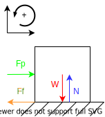

Assume the mass of the assembly is at worst:
$$
m_{\text{assembly}} = 5 \space kg
$$

Considering the vertical acting forces:
$$
\begin{aligned}
\sum{F_y} = N - W &= 0 \\
N &= W \\
N &= m_{\text{assembly}} \times g \\
&= 5 \times 9.81 \\
&= 49.05 \space N \space \darr \\
\end{aligned}
$$

Air ducts all use aluminium. The [static friction of coefficient](atc.sjf.stuba.sk/files/mechanika_vms_ADAMS/Contact_Table.pdf) between rubber and aluminium is:
$$
\mu_{\text{rubber, aluminium}} = 0.8
$$

Considering the acting horizontal forces for the body to not slip:
$$
\begin{aligned}
\sum{F_x} = F_p - F_f &< 0 \\
F_p &< F_f \\
F_{\text{fluid, safe}} &< \mu_{\text{rubber, aluminium}} \times N \\
10 &< 0.8 \times 49.05 \\
10 \space N &< 39.24 \space N \text{ which holds true} \\
\end{aligned}
$$

Since the inequality holds true, the assembly will not slip.

## Tipping 🎩

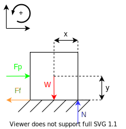

The position of the centre of mass (with respect to a bottom corner of the assembly) is given by Solidworks:
$$
(x, y) = (135, 125) \space mm
$$

Consider the moment about the corner of tip for the body to not tip:
$$
\begin{aligned}
\sum \tau = \tau_{p} - \tau_{g} &< 0 \\
\tau_{p} &< \tau_{g} \\
y \times F_p &< x \times F_g \\
y \times F_{\text{fluid, safe}} &< x \times m_{\text{assembly}} \times g \\
0.125 \times 10 &< 0.135 \times 5 \times 9.81 \\
1.25 \space Nm &< 6.62 \space Nm \text{ which is true}\\
\end{aligned}
$$

Since the inequality holds true, the assembly will not tip.

## Tipping Angle 📐

Where:
- $\theta \space (\degree)$ is the tilt angle of the body.
- $\phi \space (\degree)$ is the angle between the base of the body and the centre of mass.
- $(x, y) \space (m)$ is the coordinates of the centre of mass with respect to the bottom corner of the assembly.

The assembly will tip if:
$$
\begin{aligned}
\theta + \phi &> 90 \\
\tan^{-1}{\left(\frac{y}{x}\right)} + \phi &> 90 \\
\tan^{-1}{\left(\frac{0.125}{0.135}\right)} + \phi &> 90 \\
\therefore \phi &> 47.2 \degree
\end{aligned}
$$

Therefore, the assembly will tip indefinitely if it has tipped over $47.2 \degree$.
