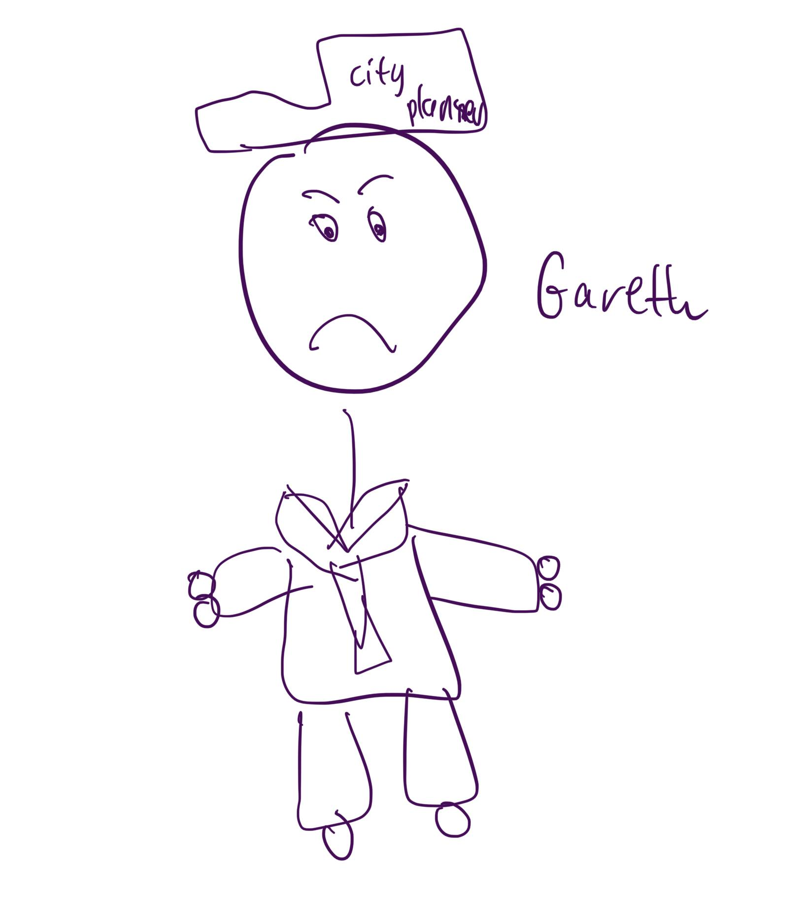

# User Design Workshop

Garreth is a city planner and he is stressed because he can't be on every road at once to gather traffic data all hours of the day.

Ideas to solve the problem of gathering traffic data for city planners:
- A series of 1D laser sensors that intersect the road horizontally (if single lane) or looks down (if multi-lane).
    - Can determine frequency and speed of vehicles moving across road.
    - No speed bumps.
    - Can estimate the weight of the vehicle by its size.
    - Easier to implement than CV.
- Hire someone to stand on the road and count the cars.
